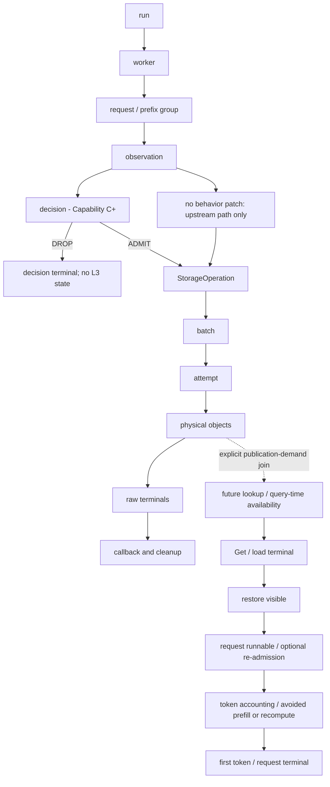
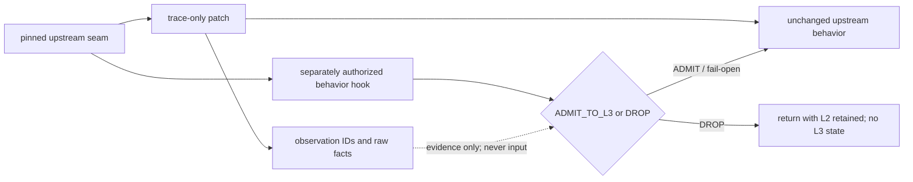

# Agentic-KV Observability, Metrics, and Correlation Contract

> 文档性质：预实现的观测、指标、跨异步层关联与证据完整性合同；不授权提前实现 trace、behavior hook 或 candidate。
>
> 本文件服从 PROJECT_EVALUATION_SOP、PROJECT_PLAN、DECISIONS 和 STATUS。
> 它冻结观测、指标、关联和证据完整性合同，不修改 Gate、STOP、scope、claim state 或当前完成状态。
> 实际进度与已验证结果以 STATUS.md 为准。

当前实现状态、激活条件和未决项以 [STATUS.md](../../STATUS.md)、
[PROJECT_PLAN.md](../project/PROJECT_PLAN.md) 与 [DECISIONS.md](../project/DECISIONS.md) 为准。

## 1. 权威、适用范围与激活边界

本文属于 implementation contract：它把未来可能获准的 trace-only instrumentation、跨异步层 correlation、
adapter physical-object observation、DecisionTrace、run manifest、指标推导、payload reconciliation、
non-interference validation 和 RCA evidence pack 约束成一套可审查语义。合同可以先于实现存在；合同中的字段、事件和
验收要求不表示当前 runtime 已经提供它们。

权威与分工如下：

```text
PROJECT_PLAN
决定：为什么测、通过什么 Gate、何时 STOP、什么结果允许形成 claim。

PERFORMANCE_ENGINEERING_PLAYBOOK
决定：面对性能异常时，如何提出假设、选择工具和完成 RCA。

PERFORMANCE_PATH_AND_OPTIMIZATION_MAP
决定：系统有哪些路径、每个节点由谁拥有、哪里可观察、哪里可修改。

OBSERVABILITY_AND_MEASUREMENT_CONTRACT
决定：具体记录什么事件、如何建立 ID 和关联、如何计算指标、
如何处理缺失/重复/乱序/失败，以及什么证据完整度允许形成哪一级结论。
```

本文服从以下材料，不复制或反向改写其完整内容：

- [AGENTS.md](../../AGENTS.md) 与 [README.md](../../README.md)；
- [PROJECT_EVALUATION_SOP.md](../project/PROJECT_EVALUATION_SOP.md)；
- [PROJECT_PLAN.md](../project/PROJECT_PLAN.md)；
- [STATUS.md](../../STATUS.md)；
- [DECISIONS.md](../project/DECISIONS.md)，尤其 D1、D12、D13、D14；
- [Performance Engineering Playbook](../performance/PERFORMANCE_ENGINEERING_PLAYBOOK.md)；
- [Performance Path and Optimization Map](../performance/PERFORMANCE_PATH_AND_OPTIMIZATION_MAP.md)；
- [G0 source/runtime audit](./G0_SOURCE_RUNTIME_AUDIT.md)；
- [D14 survival preregistration contract](./G0_D14_SURVIVAL_PREREGISTRATION_CONTRACT.md)；
- [first-C0 deployment retrospective](./G0_FIRST_C0_DEPLOYMENT_RETROSPECTIVE.md)。

当前正式机制只有 **Shared-L3 Publication Admission**。唯一 owned behavior-changing decision 是：

```text
L1 → L2 backup 完成
→ L2 ack
→ prefix-closure 检查
→ ADMIT_TO_L3 | DROP
→ upstream Mooncake Put 或直接返回
```

SGLang HiCache、L1/L2 生命周期、backup queue、remote lookup、restore、scheduler 和模型执行属于 upstream；
Mooncake shared L3、Put/Get、传输、存储和远端容量管理属于 upstream。本项目可拥有最小 trace-only
instrumentation、跨异步层 correlation、缺失的 adapter-visible physical-object observation、admission behavior
hook、workload、runner、分析和证据，但这些能力仍须按 canonical Gate 激活。

截至 [STATUS.md](../../STATUS.md) 当前记录：首次 C0 已通过并封存；fresh C1、S1–S3 尚未执行；trace
instrumentation、D1 pre-collapse new-physical-Put observation、`ALWAYS_ADMIT` / `ALWAYS_DROP` behavior hook
尚未实现；candidate 尚未授权设计；不存在 TTFT、Goodput 或 payload-efficiency 正结果。本文不提高这些状态。

本文不是新版路线图、tracing 工具教程、通用 telemetry 平台、OpenTelemetry 全栈、L1/L2/L3 simulator、
policy replay、candidate 设计、远端 eviction 观测系统、当前结果记录或性能收益声明。本文件本身不构成 D1
instrumentation、behavior hook 或 candidate 的实施授权。

## 2. 合同设计原则

### 2.1 观测与行为严格分离

```text
trace-only instrumentation
≠
behavior-changing admission hook
```

二者必须分 commit、分测试、分 feature flag、分 claim。trace ID 不得参与 cache key、lookup、queue、batch、
retry、Put/Get、scheduler 或 policy 语义；trace failure 不得导致 serving failure。behavior patch 未实现或未激活时，
不得创建、推测或补造 `decision_id`。

### 2.2 先确定性关联，再讨论时间相关性

跨线程、进程和 worker 的因果关系必须依靠：

```text
opaque ID
+ explicit propagation
+ worker-local monotonic sequence
+ source-verified parent/child relationship
```

wall-clock 邻近、storage key 猜测、日志文本模糊匹配、线程名、文件顺序或不同进程的相似时间戳都不能作为主要
join oracle。key hash 只能是已由显式父子关系约束后的完整性检查，不能单独创造因果边。

### 2.3 原始事实与派生指标分离

数据层级依次为：原始事件、physical-object raw terminal、run-local 聚合、paired-run effect、modeled/sensitivity
指标。每个派生值必须保留输入事件、公式版本、manifest、分析版本和 artifact checksum；不得覆盖或删除原始事实。

### 2.4 失败、缺失和不完整是数据的一部分

不得丢弃失败请求后只统计成功请求、静默忽略 orphan、把缺失 terminal 当成功、把 race 折叠成 new Put、把
unavailable 默认归因 eviction，或在采集窗口结束时把 right-censored object 直接记为 unused。

### 2.5 最小必要观测

每个字段必须服务于一个现存 Gate、RCA、完整性检查或 claim ceiling；若已有字段可可靠派生，便不重复采集。
不为远期可能性建设通用 collector 平台、插件系统、动态 policy service 或新的控制面。

## 3. 观测能力的激活层级

下表是能力分层，不是新 Gate、claim state 或实施顺序；激活条件仍由 canonical 文档裁决。

| Capability | Activation condition | Allowed observation | Forbidden claim |
|---|---|---|---|
| A：stock-only 外部证据 | fresh C1、S1–S3 的 stock-only 阶段 | upstream logs、client timing、token accounting、runtime config echo、stock-visible metrics、Store/process/system counters、workload manifest | new physical Put attribution、decision correlation、physical-object ownership、candidate causality |
| B：trace-only correlation | canonical survival ruling 或已生效窄例外明确允许，且独立实现/测试 | prospective seam 的 `observation_id`、operation/batch/attempt/adapter result correlation、object raw terminal、queue/lifecycle observation | ADMIT/DROP 已改变行为、candidate 有效、性能收益 |
| C：behavior decision correlation | trace non-interference 通过，behavior hook 另获授权并实现 | `decision_id`、action、稳定 reason code、online input snapshot、policy overhead | candidate 胜出、endpoint 因果收益，除非再有在线 paired evidence |
| D：targeted diagnostic extension | 具体 Gate/RCA 证明现有观测不能裁决，且单独批准 | scheduler re-admission、CPU/GPU/copy timeline、profiler marker、额外 queue/resource observation | 默认常驻、修改 upstream behavior、把 profiler run 当 headline |

## 4. 实体、标识符与命名空间

ID 都是 opaque value。除 `process_id` / `thread_id` 这类局部诊断字段外，业务关联 ID 不应复用系统 PID、明文 key、
prompt hash 或全局可逆标识。`storage_operation_id` 是 event schema 中对 upstream `StorageOperation.operation_id` 的
明确命名；实现时若 upstream 字段名保持 `operation_id`，schema adapter 必须做无歧义映射。

### 表 1：ID 生命周期与 cardinality

| ID | Creation point | Owner | Scope | Lifetime | Cardinality | Required / optional | Privacy rule |
|---|---|---|---|---|---|---|---|
| `run_id` | runner 在一次独立运行冻结后生成 | experiment runner | 单 run | manifest 创建至 artifact finalization | 1 per run | 所有事件必需 | 随机 opaque；不得编码用户信息 |
| `pair_id` | paired-run 设计冻结时生成 | runner | 一组可比 arms | pair 完成与归档 | 1 pair → 2+ run；exact arms 服从 manifest | paired 实验必需，否则 `null` | 不跨实验目的复用 |
| `arm_id` | manifest 冻结 treatment 时指定 | runner | run 内 treatment | run | 1 per run | treatment run 必需 | 稳定枚举/opaque label，不含结果 |
| `worker_id` | run admission 时分配 | runner/runtime adapter | run 内 worker lifecycle | worker lifecycle | 1 run → 1+ workers | worker 事件必需 | run-local opaque；不使用主机名作唯一 ID |
| `process_id` | producer 启动时记录 | runtime/collector | worker-local process | process lifetime | 1 worker → 1+ processes | 产生 runtime event 时必需 | 仅 run-local；不得作为跨重启 identity |
| `request_id` | client 发请求前生成并显式传播 | client runner | run 内 request | request terminal + drain | 1 per request | request/read-path 事件必需 | opaque；不由 prompt 导出 |
| `session_id` | fixed workload DAG materialize 时生成 | workload runner | run 或 workload instance | session DAG lifetime | 1 session → 1+ turns | workload 需要 session 语义时必需 | opaque；默认不跨 run join |
| `turn_id` | fixed workload DAG materialize 时生成 | workload runner | session 内 turn | turn/request evidence lifetime | 1 turn → 1+ requests：`UNRESOLVED` | 适用 workload 时必需 | opaque；不得编码文本 |
| `prefix_group_id` | workload DAG 或 prospective seam 对完整 group 赋值 | workload/runtime correlation | run 内 logical publication/demand group | group terminal + horizon/drain | group 与 request/operation 的精确 cardinality：`UNRESOLVED` | group 事件必需 | keyed/opaque；不得保存完整 storage key |
| `observation_id` | prospective seam、在 behavior decision 之前创建 | trace-only instrumentation | 一次 prospective publication observation | cleanup 或明确 unresolved terminal | callback/group 粒度受 pinned source 约束；runtime cardinality 仍须复核 | Capability B+ 写路径必需 | 随机 opaque；不参与行为 |
| `decision_id` | behavior hook 激活后、一次合法 decision 形成时创建 | owned behavior hook | 一次 decision | decision terminal + evidence retention | 预期 1 observation → 0/1 decision；实现前复核 | Capability C+；无 hook 时必须为空/省略 | opaque；不得事后补造 |
| `storage_operation_id` | upstream `write_storage` 创建 `StorageOperation` 时取得或映射 | upstream SGLang + correlation adapter | worker process | operation terminal + cleanup | ADMIT group → operation 数：`UNRESOLVED` | ADMIT 且 operation 存在时必需 | opaque；不得改变 upstream ordering |
| `batch_id` | controller 形成一个可区分 batch 时创建 | trace-only instrumentation | process / operation | batch terminal | operation → batch 数：动态且 `UNRESOLVED` | Capability B+ 有 batch 时必需 | opaque；不参与 batching |
| `attempt_id` | 一次真实 adapter/backend attempt 开始前创建 | controller/adapter trace | batch / process | attempt terminal | batch→attempt 与 retry 语义：`UNRESOLVED` | attempt 事件必需 | opaque；retry 不得靠猜测 |
| `physical_object_id` | adapter `_batch_preprocess` 展开 object 后生成或映射 | adapter trace | attempt | object raw terminal + horizon join | logical page → K/V/split-head objects；精确数量依配置，`UNRESOLVED` | object event 必需 | keyed opaque object ID；禁止完整 key |
| `event_id` | producer 发出事件时生成 | event producer | run 全局唯一 | artifact retention | 1 per logical event emission | 所有事件必需 | 随机或 producer+sequence；不可碰撞 |
| `local_sequence` | 每个 producer 原子递增 | event producer | `(run_id, worker_id, process_id, producer)` | process lifetime | strictly monotonic per producer；重启不得续猜 | 所有 runtime event 必需 | 无用户内容 |

`observation_id` 必须在 prospective seam 创建。没有 behavior hook 时，Capability B 可以合法存在 observation、operation、
batch、attempt 与 object ID，但 `decision_id` 必须为 `null` 或按 schema 规则省略；两种表示只能选一种并随
`schema_version` 固定。本文示例选择显式 `null`。`decision_id` 绝不能从后续 operation 或日志事后推测。

一个逻辑 prefix group 对应多少 `StorageOperation`、operation 如何进入 batch、retry 是否产生新 attempt、一个 logical
page 展开多少 physical object，都不得为填表而编造：

> **UNRESOLVED — implementation 前必须完成 pinned-source audit。**

## 5. 关联图与父子关系

### 图 1：完整关联链



显式 propagation 提供 observation→operation→batch→attempt→physical object 的父子边；pinned runtime event 提供
operation/queue/callback 与 lookup/Get/load terminal；固定 workload DAG 提供 session/turn/request、planned demand 和
prefix group 的实验关系；`useful restore`、horizon annotation、effect 和 claim ceiling 只能在原始事件冻结后事后分析。

later demand 不得只靠相同 key 或相似时间推测。可接受 join 至少要求 workload 中的稳定 demand ID 或 runtime 显式
request/prefix reference，再以 keyed object identifier 作一致性检查。不同 treatment 的 lifecycle 不能通过另一 arm 的
eligibility stream 或 conditional ledger 伪装成真实反事实。

### 图 2：观测与行为分离



trace-only patch 不决定 action。behavior hook 只读取决策时合法在线输入，不能读取 post-hoc annotation、future label 或
另一个 arm 的结果。

## 6. 统一事件信封

事件类型、status 和 reason 必须是 versioned enum / stable code，不能依赖自由文本日志句子。逻辑 envelope：

```json
{
  "schema_version": "example-v1",
  "event_id": "opaque-event",
  "event_type": "PHYSICAL_PUT_RAW_TERMINAL",
  "run_id": "opaque-run",
  "pair_id": "opaque-pair-or-null",
  "arm_id": "opaque-arm-or-null",
  "worker_id": "opaque-worker",
  "process_id": "opaque-process",
  "thread_id": null,
  "local_sequence": 431,
  "monotonic_timestamp": 12345.6789,
  "wall_timestamp": "2026-08-14T12:00:00.000000+08:00",
  "request_id": "opaque-request-or-null",
  "prefix_group_id": "opaque-group-or-null",
  "observation_id": "opaque-observation",
  "decision_id": null,
  "storage_operation_id": "opaque-operation",
  "batch_id": "opaque-batch",
  "attempt_id": "opaque-attempt",
  "physical_object_id": "keyed-object-id",
  "status": "RACE_EXISTING",
  "payload": {
    "buffer_bytes": 1048576,
    "reason_code": "OBJECT_ALREADY_EXISTS_PRE_COLLAPSE"
  }
}
```

这只是文档级逻辑示例，不是已实现 schema、validator 或当前事件。`example-v1` 是占位值，不是已发布版本。

始终必需：`schema_version`、`event_id`、`event_type`、`run_id`、`worker_id`、`process_id`、`local_sequence`、
`monotonic_timestamp`、`status`。`wall_timestamp` 只用于人工定位。其他 ID 由 event type 决定；不适用字段显式为
`null`，缺失 required field 则事件非法，不能把“未采集”与“不适用”混为一谈。未来 schema 变更必须增加版本并保留
reader compatibility 或显式拒绝，禁止静默改变字段含义。

payload 禁止包含 raw prompt、token 文本、token ID 序列、用户输入输出、tool result 原文、认证信息、完整业务 key，
也不得携带 future demand label 给在线 policy。

## 7. 写路径逻辑事件

### 表 2A：写事件词典

表中为节省宽度，`run`、`worker`、`request`、`prefix group`、`observation`、`decision`、`storage operation`、
`batch`、`attempt` 和 `physical object` 分别指对应的 `*_id` 字段，而不是可由日志文本重建的对象名。

| Logical event | Trigger point | Required IDs | Required payload | Terminal semantics | Current availability |
|---|---|---|---|---|---|
| `PUBLICATION_ELIGIBLE` | upstream 条件使 node/group 进入 prospective publication | run, worker, prefix group | logical page/token count；eligibility code | 非终态；仅说明 eligible | stock seam SOURCE_VERIFIED；结构化事件 ROADMAP |
| `OBSERVATION_CREATED` | prospective seam，decision 之前 | run, worker, observation, prefix group | source seam/version | observation 生命周期起点 | ROADMAP；受 canonical activation 约束 |
| `L2_ACK_VISIBLE` | L2 DMA ack 已被当前路径观察 | run, worker, observation | ack code；不得改变 ack | 证明 prospective observation 位于 ack 后 | source path SOURCE_VERIFIED；event ROADMAP |
| `PREFIX_GROUP_CONSTRUCTED` | keys/host indices/prefix keys 已构造 | observation, prefix group | logical count、closure inputs/结果；无明文 key | group 构造事实；不是 decision | source construction SOURCE_VERIFIED；event ROADMAP |
| `DECISION_MADE` | behavior hook 激活后 action 固定 | observation, decision, prefix group | action、reason code、online input namespace、decision duration | DROP 进入 decision terminal；ADMIT 继续 | behavior-hook-gated；当前未实现 |
| `STORAGE_OPERATION_CREATED` | `write_storage` 创建 operation | observation, storage operation；decision 仅 Capability C+ | logical item count | operation 生命周期起点 | source fact available；correlation ROADMAP |
| `BACKUP_ENQUEUED` | operation 加入 backup queue | storage operation | queue ID/class；enqueue local time | 非终态 | ROADMAP；无侵入可得性待复核 |
| `BACKUP_DEQUEUED` | backup thread 接管 operation | storage operation | queue depth/dwell inputs | queue ownership转移 | ROADMAP；可得性待复核 |
| `BATCH_CREATED` | controller 划分 batch | storage operation, batch | batch ordinal、logical page count | batch 生命周期起点 | ROADMAP；cardinality UNRESOLVED |
| `ATTEMPT_STARTED` | adapter/backend 的一次真实 attempt 开始 | batch, attempt | operation kind、object count | attempt 生命周期起点 | ROADMAP；retry 语义 UNRESOLVED |
| `EXISTS_CHECK_TERMINAL` | precheck 对 physical objects 返回 | attempt, physical object | exists/missing/error；payload bytes 必须为 0 | exists skip 或提交候选；非 Put success | ROADMAP；exact codes UNRESOLVED |
| `PHYSICAL_PUT_SUBMITTED` | object 实际提交 Put | attempt, physical object | physical payload bytes | 仅 submitted，不是 new Put | ROADMAP |
| `PHYSICAL_PUT_RAW_TERMINAL` | Mooncake success collapse 之前得到 object result | attempt, physical object | `NEW_OBJECT_SUCCESS` / `RACE_EXISTING` / `FAILURE` / `UNSUPPORTED_UNCLASSIFIED`，buffer bytes，raw stable code | object raw terminal；不得被 operation 聚合覆盖 | D1-gated；当前未实现；exact code map UNRESOLVED |
| `OPERATION_TERMINAL` | upstream operation completion 对上层可见 | storage operation | success/failure/collapsed result、object coverage summary | operation terminal，不抹除 object facts | ROADMAP；partial-success 当前不声称支持 |
| `HOST_PROTECTION_RELEASED` | ack/detach 释放 host protection | storage operation | release reason | 对应保护闭合 | source cleanup fact；correlation ROADMAP |
| `CORRELATION_RELEASED` | terminal/detach 后删除 owned correlation state | observation, storage operation（若存在） | release reason、remaining count | owned correlation 生命周期闭合 | ROADMAP |

`PHYSICAL_PUT_RAW_TERMINAL` 必须区分 new object success、precheck exists skip、race-existing、failure 与
unsupported/unclassified。precheck exists skip 由 `EXISTS_CHECK_TERMINAL` 表达，不伪装成 Put terminal。固定 Mooncake
pin 中 `OBJECT_ALREADY_EXISTS` 会在现有 Python-visible terminal 前归约为 success，因此 D1 pre-collapse observation
未实现前，不能从 `put_result=0` 推断 new Put。精确原因码与 collapse 点若重新审计后变化，必须更新 schema 版本，不能
用日志文本兜底。

## 8. DROP 路径合同

未来 Capability C 必须用显式终态证明：

```text
eligible observation
→ decision = DROP
→ no StorageOperation
→ no backup queue entry
→ no ongoing_backup
→ no host protection
→ no Mooncake Put
→ L2 remains available
→ decision terminal
```

“没有看到 Put 日志”不构成 absence proof。必须同时有 decision terminal、operation/queue/adapter absence oracle、
L2 可用性和生命周期状态；观测窗口要覆盖预注册 measurement + drain + 最大允许异步晚到边界。DROP 不生成伪造的
Put terminal。policy exception 必须 fail-open 为 ADMIT，且记录为 `POLICY_ERROR_FAIL_OPEN`，不能写成 DROP。

如果 trace loss 或 missing parent 使“真实没有 operation”与“operation 事件丢失”不可区分，该 object 及相关 run 对 DROP
claim 没有裁决权，结果为 `INCONCLUSIVE` 或按 manifest 的 invalid rule 处理。

## 9. ADMIT 路径合同

```text
eligible observation
→ decision = ADMIT
→ operation creation
→ queue
→ batch / attempt
→ physical object handling
→ raw terminal
→ operation terminal
→ cleanup
```

ADMIT 不等于 submitted；submitted 不等于 new physical Put；adapter success 不一定表示当前 writer 新建 object。
operation terminal 不得覆盖 object-level race/failure。callback completion、host protection release、buffer/ref release 和
correlation release 必须分别可验证。

一个 logical group 展开成多个 logical pages 和 physical K/V/split-head objects 时，必须保留全映射。固定 source 表明
controller 会把 logical pages 分 batch、adapter 会展开 physical objects，但精确 cardinality 随配置与运行输入变化；实现前
必须重新审计。固定 upstream 未实现 partial success 时，合同只能记录“不支持/无法分类”，不得用 mock 把 partial success
升级为 runtime claim。

## 10. 读路径与 useful restore 事件

### 表 2B：读事件词典

本表沿用表 2A 的 ID 简写规则；每条真实事件仍必须携带 event type 所要求的完整 `*_id` 字段。

| Logical event | Trigger point | Required IDs | Required payload | Terminal semantics | Current availability |
|---|---|---|---|---|---|
| `PREFIX_LOOKUP_STARTED` | request 开始 prefix resolution | run, worker, request, prefix group | requested logical length | lookup 起点 | source path available；结构化 correlation ROADMAP |
| `LOCAL_L1_RESULT` | L1 lookup 返回 | request, prefix group | hit/miss/continuous length | L1 阶段终态 | stock-visible程度待 runtime 复核 |
| `LOCAL_L2_RESULT` | L2 lookup 返回 | request, prefix group | hit/miss/continuous length | L2 阶段终态 | stock-visible程度待 runtime 复核 |
| `EXTERNAL_LOOKUP_STARTED` | shared L3 lookup 发起 | request, prefix group | logical page count | 外部 lookup 起点 | source path available；correlation ROADMAP |
| `AVAILABILITY_TERMINAL` | ordered lookup/exists 返回 | request, prefix group | available continuous pages、first-miss/unknown | availability 终态，不是 Get | adapter/source 部分可用；完整 join ROADMAP |
| `GET_SUBMITTED` | physical Get 提交 | request, attempt, physical object | physical payload bytes | submitted，不是 completed | ROADMAP；attempt mapping UNRESOLVED |
| `PHYSICAL_GET_TERMINAL` | object load 返回 | request, attempt, physical object | success/failure/bytes | completed Get 事实，不是 useful restore | first-C0 有 scoped path artifact；通用 trace ROADMAP |
| `RESTORE_VISIBLE` | restored state 对 runtime 后续阶段可见 | request, prefix group | restored logical/token/page count | restore visibility；不等于 runnable | pinned token-accounting source available；精确 seam UNRESOLVED |
| `REQUEST_RUNNABLE` | request 具备执行所需状态 | request | runnable reason | runnable 终态；不等于已被 scheduler 选中 | targeted observation 需求待裁决 |
| `SCHEDULER_READMITTED` | scheduler 重新选择 restored request | request | queue/batch identity | re-admission terminal | targeted-diagnostic-only；无需要时不实现 |
| `PREFILL_ACCOUNTED` | runtime 形成 prompt/cache token accounting | request | prompt、storage-cached、uncached tokens | token accounting 终态 | pinned runtime accounting available；first-C0 有 scoped artifact |
| `FIRST_TOKEN_EMITTED` | client 收到首 token | request | client monotonic time | TTFT endpoint terminal | client runner authority；fresh C1 contract 待执行 |
| `REQUEST_TERMINAL` | completion/error/hang classification | request | completion status、output oracle reference、token counts | request 终态 | client/stock evidence available |

availability/exists、completed Get、restore visible、request runnable、scheduler re-admission 和 useful restore 是不同状态。
没有 scheduler event 时，不精确分解 runnable→admit latency；只有当前 Gate/RCA 确实需要时才加入 targeted observation。
output correctness 始终由独立 oracle 裁决。

## 11. 时间语义合同

### 11.1 Worker-local monotonic time

同一 monotonic clock domain 内可计算 queue dwell、decision overhead、adapter service time、callback delay 和本地阶段顺序。
duration 两端必须携带相同 clock-domain identity；跨进程即使在同一机器也不能默认同一 domain。

### 11.2 Worker-local sequence

`local_sequence` 用于同一 producer 稳定排序、发现 duplicate/gap/out-of-order，并在 wall clock 不可靠时重建 local order。
进程重启必须产生新 `process_id`，不能把 sequence 连续性跨重启猜接。

### 11.3 Wall-clock time

wall clock 仅用于人工排查、粗略对齐外部日志和定位运行窗口。默认不能用于跨节点精确 duration、causal ordering 或把
不同进程 timestamp 直接相减。NTP 同步不自动提供足够精度；若未来确需跨节点同步，必须另有校准 artifact、误差界和
适用窗口。

### 11.4 Client time

冻结的 client runner 是 request arrival、first token、completion、TTFT 和 E2E 的 endpoint 权威候选来源；具体来源仍
服从 D14 preregistration。跨进程阶段只能通过 ID 与各自局部 duration 分解。局部 duration 可能 overlap，不能全部相加成
TTFT。profiler clock 与 trace clock 的对齐默认只作诊断，不拥有全局精确时间语义。

## 12. 指标分类与命名规则

### 12.1 Endpoint metrics

- `goodput_at_ttft_slo`：measurement window 中 completion 成功且 TTFT 不超过 frozen SLO 的请求数 / window seconds；
- TTFT p50/p95/p99：诊断量，不得事后挑最有利分位数；
- TPOT guardrail；
- request success/error/hang；
- completion throughput，仅在 canonical experiment/manifest 指定时使用。

主 endpoint、SLO、重复和统计区间以 `PROJECT_PLAN` 与 D14 preregistration 为准，本文不定义数值。TTFT 改善不能掩盖
TPOT、correctness 或 lifecycle regression。

### 12.2 Path and token metrics

prompt tokens、storage-cached tokens、uncached prompt tokens、remote-Get materiality、useful restored tokens、avoided
prefill tokens、recomputed tokens必须携带 request join、适用 cohort 和 missing-data rule。只有 Get terminal 不足以把全部
bytes/tokens 计为 useful。

### 12.3 Publication action metrics

eligible/admitted/dropped groups 与 bytes、action coverage、reason-code distribution、decision overhead。没有 behavior hook
时 admitted/dropped/action/reason/decision overhead 不存在，不能从 upstream outcome 反推。

### 12.4 Physical payload metrics

以下名称与 canonical 定义保持一致：

- `logical_kv_bytes`
- `eligible_payload_bytes`
- `admitted_payload_bytes`
- `submitted_payload_bytes`
- `new_physical_put_bytes`
- `race_existing_bytes`
- `exists_skip_bytes`
- `failed_put_bytes`
- `completed_get_bytes`
- `dedup_or_race_skipped_bytes`

### 12.5 Lifecycle、queue 与 resource metrics

operation count、batch/attempt count、queue depth/dwell、outstanding operations/bytes、host protection duration、cleanup lag、
orphan/late terminal count用于生命周期和机制诊断。worker/Store CPU/RSS、NIC counters、GPU timeline/utilization、context
switch/scheduling counters属于 resource mediator 或诊断量，不能单独通过性能因果链。adapter payload 不是 wire traffic；
GPU utilization 不是 kernel efficiency。

## 13. 指标词典

### 表 3A：endpoint、path 与 action 指标

| Metric | Semantic definition | Unit | Raw source | Derivation | Aggregation level | Missing-data rule | Claim ceiling | Current availability |
|---|---|---|---|---|---|---|---|---|
| `goodput_at_ttft_slo` | frozen window 内成功且 TTFT≤SLO 的 completion rate | req/s | client runner | qualifying completions / seconds | run、paired run | endpoint event/窗口不完整则 run invalid | endpoint truth in frozen cohort | ROADMAP for fresh D14 runs；first-C0 不提供性能 claim |
| `ttft` | arrival 到 first token 的 client-local duration | time | client runner | same client clock subtraction | request→run distribution | 任一端缺失则 request error/unresolved，不插值 | endpoint diagnostic | stock client available |
| `tpot` | decode token 间平均/冻结定义 duration | time/token | client runner | manifest-fixed formula | request/run | token terminal 缺失则不可计算 | guardrail only unless canonical endpoint | stock client available |
| `request_success_count` | 按冻结 correctness contract 成功完成的请求数 | count | client + output oracle | status filter | run | 不得删除 error/hang | correctness | stock client available |
| `prompt_tokens` | request prompt token count | token | pinned runtime/client manifest | direct | request/run | 缺失则 token-derived metrics unresolved | input/accounting | stock upstream available |
| `storage_cached_tokens` | pinned runtime 归因 storage source 的 cached tokens | token | pinned runtime accounting | direct per request | request/run | 必须与 matching Get/load 对齐，否则仅 accounting observation | path/mechanism when joined | first-C0 scoped artifact；stock available |
| `uncached_prompt_tokens` | prompt tokens 减 cached tokens，按 pinned runtime contract | token | pinned runtime accounting | frozen runtime formula | request/run | source/config 不匹配则 invalid | prefill mechanism candidate | first-C0 scoped artifact；stock available |
| `remote_get_materiality` | eligible B-cold requests 中 matching remote Get 对应 storage-cached token share | ratio | Get/load + token accounting | D14 frozen formula | run/paired interval | 分母≤0 或 join 不完整则 INCONCLUSIVE | S1 mechanism quantity, not hit rate | ROADMAP for S1 |
| `useful_restored_tokens` | 成功 restore 且实际被 request 使用并替代 prefill 的 token | token | request/Get/restore/token events | strict useful-restore filter | request/run | 任一必要条件缺失则不计为 useful，并报告 unresolved | mechanism truth | ROADMAP；first-C0 仅有 scoped substitution evidence |
| `avoided_prefill_tokens` | 相对 matching cold/no-L3 control 可归因少做的 prefill tokens | token | paired token accounting | frozen paired formula | paired request/run | 不可比或输出错误则 INCONCLUSIVE | mechanism truth | first-C0 scoped evidence；正式指标 ROADMAP |
| `recomputed_tokens` | 因 unavailable/miss 实际执行的 prompt/prefill tokens | token | pinned accounting + request trace | frozen formula | request/run | 不从 unavailable 单独估算 | mechanism truth | ROADMAP/UNRESOLVED exact source |
| `eligible_groups` / `eligible_payload_bytes` | upstream L3 write eligibility 的 groups / physical payload | count/bytes | seam + adapter mapping | sum eligible entities/bytes | run | mapping residual 非零则 bytes claim blocked | eligibility truth | ROADMAP；physical bytes mapping UNRESOLVED |
| `admitted_groups` / `admitted_payload_bytes` | behavior decision 为 ADMIT 的 groups / payload | count/bytes | DecisionTrace + mapping | action-filtered sum | run | 无 decision_id 时指标不存在 | action truth | behavior-hook-gated |
| `dropped_groups` / `dropped_payload_bytes` | behavior decision 为 DROP 的 groups / payload | count/bytes | DecisionTrace + mapping | action-filtered sum | run | absence oracle 不完整则 INCONCLUSIVE | action truth | behavior-hook-gated |
| `action_coverage` | eligible observations 中拥有合法 decision terminal 的比例 | ratio | observation + decision | decided / eligible | run | 分母 0 报绝对值；missing decision 不作 DROP | trace quality | behavior-hook-gated |
| `reason_code_distribution` | 各稳定 decision reason 的 action 分布 | count/share | DecisionTrace | group by code | run | unknown code 单列，不丢弃 | decision characterization | behavior-hook-gated |
| `decision_overhead` | 同进程 decision start→terminal duration | time | monotonic decision events | subtraction within clock domain | decision/run | clock/domain不一致则不可算 | non-interference/diagnostic | behavior-hook-gated |

### 表 3B：payload、lifecycle 与 resource 指标

| Metric | Semantic definition | Unit | Raw source | Derivation | Aggregation level | Missing-data rule | Claim ceiling | Current availability |
|---|---|---|---|---|---|---|---|---|
| `logical_kv_bytes` | tensor shape/dtype 与 pinned config 定义的逻辑 KV 大小 | bytes | tensor/config manifest | frozen formula | page/group/run | config/shape 缺失则不可算 | logical payload only | source/model derived；runtime mapping待复核 |
| `submitted_payload_bytes` | precheck 后实际提交 Put 的 physical object payload | bytes | adapter object submit event | sum submitted object buffer sizes | object/attempt/run | submit terminal缺失则 unresolved | submitted payload only | ROADMAP |
| `new_physical_put_bytes` | pre-collapse 明确由当前 writer 新建 object 的 payload | bytes | D1 raw terminal | sum NEW_OBJECT_SUCCESS bytes | object/attempt/run | D1缺失、loss或unsupported residual时 claim blocked | physical new-Put truth | D1-gated；当前未实现 |
| `race_existing_bytes` | precheck miss、Put 时发现竞争 object 已存在的 payload | bytes | D1 raw terminal | sum RACE_EXISTING bytes | object/attempt/run | 不得折叠到 new Put | race attribution | D1-gated |
| `exists_skip_bytes` | precheck 已存在、未提交 Put 的 object payload | bytes | adapter preprocess + exists terminal | sum skipped object buffer sizes | object/attempt/run | exists result缺失则 unresolved | sequential dedup attribution | ROADMAP |
| `failed_put_bytes` | 未得到 new/race success terminal 的 submitted payload | bytes | D1/adapter raw terminal | sum failure bytes | object/attempt/run | unsupported 单列；不得默认 failure/success | failure attribution | D1-gated / exact map UNRESOLVED |
| `completed_get_bytes` | backend 确认成功的 Get physical payload | bytes | adapter raw Get terminal | sum success bytes | object/attempt/request/run | terminal缺失则不计成功并报告 unresolved | completed Get, not useful restore | ROADMAP；first-C0仅 scoped path evidence |
| `dedup_or_race_skipped_bytes` | `exists_skip_bytes + race_existing_bytes` | bytes | 两项原始指标 | exact sum | run | 任一项 unresolved 则整体 unresolved | derived payload summary | D1-gated |
| `useful_restored_bytes` | matching Get 中实际被 request 使用并替代 prefill 的可归属 physical payload | bytes | object/Get/request/token join | strict useful-restore filter + verified page/token-to-object mapping | request/run | mapping或任一必要 terminal 缺失则 unresolved | mechanism truth, not endpoint benefit | ROADMAP；mapping UNRESOLVED |
| `not_read_within_h_bytes` | 在预注册 H 内拥有完整观察机会、但无 useful Get 的 successful new-Put payload | bytes | D1 terminal + demand/Get horizon events | uncensored eligible objects 的 sum | object/run | right-censored排除或单列；trace loss阻止完整 claim | bounded-horizon payload waste | D1-gated + complete horizon trace |
| `closed_dag_unused_bytes` | closed workload DAG 完整 drain 后仍无合法 useful demand 的 successful new-Put payload | bytes | fixed DAG + D1/Get terminals | strict closed-DAG filter | object/run | DAG/drain/terminal任一不完整则不可算 | closed-workload unused only | ROADMAP，D1-gated |
| `write_amplification` | new physical Put payload / useful completed L3 Get payload | ratio | D1 + useful-restore bytes | frozen numerator / denominator | run/paired run | denominator=0时仅报两个绝对值，不给比例 | payload diagnostic only | ROADMAP，D1-gated |
| `operation_count` | 创建的 StorageOperation 数 | count | operation-created event | count unique IDs | run | duplicate按event_id处理；missing parent单列 | lifecycle/action mediator | ROADMAP |
| `batch_count` / `attempt_count` | unique batch / real attempt 数 | count | batch/attempt events | unique ID count | operation/run | retry/cardinality未知不补造 | lifecycle mediator | ROADMAP/UNRESOLVED |
| `queue_depth` | 指定 queue 在观测时点的 outstanding entries | count | same owner counter/event | sampled/event-derived | worker/run | sampling/loss需标注；不能替代 dwell | resource mediator | ROADMAP或stock诊断 |
| `queue_dwell` | 同 operation enqueue→dequeue 的 local monotonic duration | time | paired queue events | same-domain subtraction | operation/run | 任一端缺失则 unresolved | mechanism/resource mediator | ROADMAP |
| `outstanding_operations` | 尚未 terminal/cleanup 的 operations | count | lifecycle events | state reconstruction | worker/run | orphan/missing terminal导致 residual | lifecycle correctness | ROADMAP |
| `outstanding_payload_bytes` | outstanding objects 的 physical payload | bytes | object lifecycle | state reconstruction | worker/run | mapping/terminal缺失则 unresolved | resource mediator | ROADMAP |
| `host_protection_duration` | protect acquire→release 的 same-process duration | time | protection events | same-domain subtraction | operation/run | release缺失即 lifecycle failure/unresolved | lifecycle correctness | ROADMAP |
| `cleanup_lag` | operation terminal→相应 owned/upstream cleanup 可见的 local duration | time | terminal/release events | same-domain subtraction | operation/run | cross-process不可算；terminal缺失不可算 | lifecycle/non-interference | ROADMAP |
| `orphan_event_count` / `late_terminal_count` | 无合法 parent / finalization边界后到达的 terminal 数 | count | collector validation | count by reason | run/artifact | 必须保留，不归零 | evidence quality | ROADMAP |
| worker / Store `cpu`、`rss` | 进程 CPU/RSS observation | percent/time, bytes | OS/process counters | frozen sampling aggregation | process/run | 缺窗口则诊断降级 | mediator only | stock/system available |
| `nic_bytes` | 指定接口/方向在冻结窗口的 OS/NIC bytes | bytes | OS/NIC counters | before/after delta | node/run | 共享流量不可归因时仅总量 | wire-side mediator, not payload truth | system available; attribution UNRESOLVED |
| `gpu_utilization` / timeline | GPU activity/timeline | percent/time | system/profiler | tool-specific | worker/run | profiler-on 不进入 headline | diagnostic only | targeted-diagnostic-only |

所有比率分母为 0 时报告 numerator、denominator 和“不定义”，不制造 0%、∞ 或替代 headline。指标名、单位、来源、
missing rule 和分析版本必须在 run manifest/未来 metric dictionary 中固定。

## 14. 数据来源权威与冲突处理

### 表 4：source-of-truth

| Evidence | Primary authority | Secondary diagnostic source | Conflict rule |
|---|---|---|---|
| request arrival / first token / completion | frozen client runner contract | server logs | endpoint 服从 client；保留差异并解释，不选更有利值 |
| storage-cached tokens | pinned runtime accounting | logs/response metadata | 必须与 matching Get/load evidence 对齐；冲突时机制 claim INCONCLUSIVE |
| physical Put raw result | D1 pre-collapse observation | adapter collapsed result | raw result保留 new/race 区别；D1缺失时禁止 new-Put claim |
| logical KV bytes | tensor shape/dtype + pinned config | modeled estimate | 与 adapter physical bytes 分开；配置不全则不可算 |
| physical payload bytes | adapter `_batch_preprocess` object sizes + terminal | logical estimate | object mapping residual 未解释时禁止 payload claim |
| queue dwell | same-process monotonic enqueue/dequeue | log wall timestamps | 不用跨进程 wall clock；端点缺失则不可算 |
| Store CPU/RSS | system/process counters | Store logs | 只作 mediator；窗口不一致时不比较 |
| NIC bytes | OS/NIC counters | adapter payload | 二者不能互换；共享接口不可归因时只报节点总量 |
| Goodput | manifest 指定的 frozen client + analysis version | aggregate server metrics | 以冻结 client contract为准；冲突未解释则 run invalid/INCONCLUSIVE |
| output correctness | frozen token/hash oracle | HTTP status/logs | status成功但output不符仍是 correctness failure |
| query-time availability | pinned adapter/runtime lookup result | Store/system logs | 只能称当时 unavailable；无 telemetry不归因 eviction |

发生冲突时保留双方 raw data、记录 schema/source/version 和裁决规则；不得选择更有利来源。若权威来源本身缺失、
不兼容或冲突无法解释，按影响范围将 object/request/run 标为 unresolved、invalid 或 `INCONCLUSIVE`，并限制 claim。

## 15. Payload reconciliation 合同

```text
logical prefix group
→ logical KV pages
→ adapter preprocessing
→ physical K/V objects
→ exists / submitted / raw terminal
```

必须保持：logical bytes ≠ physical-object payload ≠ NIC/wire bytes；ADMIT ≠ submitted ≠ new Put；success collapse 可能
隐藏 race-existing；`batch_exists` payload bytes 为 0；一个 group 可能产生多个 physical objects；所有 object result 必须
回连 observation/decision/operation。

实现时按以下步骤对账：

1. 对 pinned source 重新验证各阶段 cardinality、object expansion、filter 和 terminal semantics；
2. 在 manifest/config 范围内定义 expected reconciliation，而不是全局假设；
3. 记录每层输入、输出和 residual；
4. residual 按 event loss、unsupported result、preprocessing failure、race、shutdown 或 source assumption 错误分类；
5. 无法解释的 residual 阻止 payload claim。

仅在 source/runtime 证明完整且没有 unsupported terminal 时，才允许检验类似下列目标关系：

```text
submitted_payload_bytes
= new_physical_put_bytes + race_existing_bytes + failed_put_bytes
```

这不是当前已成立的守恒式；若 retry、partial handling、preprocessing failure 或 unsupported terminal 改变集合，必须先修订
定义。不要为了闭合等式虚构 `pre_submit_failure_bytes` 等 headline metric；确需新字段时标为 implementation-time
`UNRESOLVED` 并请求 owner review。

## 16. useful restore 与 prefill substitution 合同

```text
completed Get
≠ useful restore
```

一个 Get 只有同时满足以下条件才进入 useful restore：

1. 与明确 request/prefix demand 通过稳定 ID 对齐；
2. Worker local coldness 成立，排除 same-run local heat；
3. Get/load terminal 成功；
4. restored state 实际对 runtime 可见并被该 request 使用；
5. storage-cached/uncached token accounting 可解释；
6. 相对 matching no-L3/B-cold control 实际减少 prefill；
7. output correctness 成立。

lookup hit count 不能替代 restored tokens；completed bytes 不能无条件计为 useful bytes。partial prefix restore 按实际
token/page substitution 归属。只能证明 Get 成功时，claim ceiling 是 path truth；再证明 prefill substitution 才是
mechanism truth；再加冻结的 paired endpoint、non-interference 和统计合同才可能形成 performance claim。

## 17. horizon、right-censoring 与 unused

### `not-read-within-H`

`H` 必须预注册。只有从 successful publication terminal 起到 `H` 结束拥有完整观察机会、且 trace terminal 完整的 object
进入分母。measurement 尾部对象若其观察机会延伸到采集结束之后，是 right-censored：从 numerator/denominator 排除或
单独报告，不能默认“没有看到 Get”就是永远不会读。

### `closed-DAG unused`

只有 workload DAG 完整闭合、future reuse schedule 已知、measurement 后包含 drain、所有合法 demand 已结束且 trace
terminal 完整，才可把全程未读 publication 记为 closed-DAG unused。

### useful-demand coverage

conditional ledger 只能对给定 source stream 做条件式分析，不能输出跨 policy TTFT、Goodput 或真实因果 ranking。
future demand label 是 post-hoc/oracle 数据，绝不能泄漏给 online candidate。

## 18. 聚合层级与统计单元

必须区分 per-event、per-physical-object、per-attempt、per-operation、per-prefix-group、per-request、per-worker、per-run、
per-paired-run 和 across-repeat interval。每个 aggregate 必须记录 denominator 类型。

禁止把同一 run 内请求当独立实验重复、把 physical object 数当 request 数、把 batch latency 均值当 request TTFT、混用
denominator 或只保存 aggregate。headline inference 以独立 run 或预注册 paired run 为统计单元；request-level distribution
只作诊断。effect、interval、最少/最多重复和 materiality 继续服从 D14 preregistration，本文不重新定义。

## 19. 缺失、重复、乱序和晚到事件

collector/analysis 必须显式处理 duplicate event、duplicate terminal、missing parent/child、orphan operation/object、
out-of-order arrival、late callback、window 后事件、shutdown before terminal、trace buffer overflow、collector restart、partial
file write 和 schema-version mismatch。

### Duplicate

用稳定 `event_id` 或 schema 定义的唯一键去重。重复内容不一致是 data conflict；保留两份 raw record 和 conflict artifact，
不得“最后一个覆盖前一个”。duplicate terminal 必须按 object/attempt terminal invariant 单独报告。

### Out-of-order

collector 接受乱序，通过 parent IDs、process identity 和 `local_sequence` 重建；文件顺序、wall clock 或日志到达顺序不构成
因果顺序。

### Missing terminal / orphan

不得默认成功。claim-bearing 路径缺 terminal 时，该 entity 明确 unresolved；若缺失会改变核心 action、分母、absence
oracle、payload reconciliation 或 useful-restore 判断，则 run invalid 或 `INCONCLUSIVE`。orphan 不静默删除。

### Late event 与 finalization

measurement window、drain window、collector close 和 analysis finalization 是不同边界。finalization 后晚到事件不能静默改写
已发布结果；必须生成新 analysis artifact/version，引用原 artifact 并标记旧结论失效或 claim ceiling 降级。

### Trace loss 与损坏

必须记录 producer/collector drop counter、buffer overflow、restart epoch、partial write 和 schema mismatch。core claim-bearing
事件不得 sampling。trace loss 非零时按已知影响面限制 claim；无法证明影响面时，不能形成完整因果链。

### Run validity 最低规则

下列任一项足以阻止对应完整 claim：manifest/checksum 不一致；endpoint window 不完整；core event loss 影响未知；
parent-child join 不闭合；重复 terminal 冲突；correctness/output failure；fresh Store/coldness/fairness 不可证；payload residual
不可解释；trace 改变 behavior；right-censoring 被错误计入 unused。是否整 run invalid 或仅局部 `INCONCLUSIVE` 由预注册的
影响范围规则决定，不能看结果后选择。

## 20. Terminal 与生命周期闭合

### 表 5：terminal / cleanup 矩阵

| Scenario | Expected terminal | Required cleanup | Allowed claim if incomplete |
|---|---|---|---|
| DROP | decision terminal | no operation/queue/ongoing backup/protection/correlation-after-terminal/L3 Put；L2可用 | absence 无法证明则 `INCONCLUSIVE` |
| Put success | object raw new-success + operation terminal | queue/ref/protection/buffer/correlation released | cleanup 不完整则 runtime invalid；不得以成功掩盖 leak |
| precheck exists | exists-skip | no Put submission/new-Put accounting；normal operation cleanup | 不能计入 new Put |
| race existing | raw race-existing | normal callback/operation cleanup | 不能折叠为 new Put |
| Put failure | raw failure / explicit unsupported terminal | resources released；serving semantics preserved | 不得记成功；缺真实 failure evidence 则该 coverage `INCONCLUSIVE` |
| policy exception | `POLICY_ERROR_FAIL_OPEN` + ADMIT lifecycle | upstream lifecycle完整闭合 | 不得记录成 DROP |
| shutdown / detach | terminal 或 explicit unresolved | 所有 owned/upstream state按真实可得路径释放 | coverage 降级或 invalid；不伪造 terminal |
| late callback | late terminal with original parent identity | 不重建已释放 state；记录处理结果 | 无法证明安全则 runtime invalid |
| trace overflow | loss counter / overflow event | serving unaffected；buffer有界 | claim 按损失范围受限；未知范围则 `INCONCLUSIVE` |

> 性能优化只有在 queue、reference、host protection、buffer 和 correlation state 全部闭合时才是有效工程优化。

## 21. 隐私与敏感数据合同

禁止记录 raw prompt、token 文本、tool result 原文、用户输入输出正文、认证信息、完整业务 storage key、可还原 prompt 的
token ID 序列。允许的最小信息是 opaque request/session/turn ID、不可逆或 keyed prefix/object identifier、token/page
count、payload bytes、event type、reason code 和 terminal status。

同一 run 内跨 worker join 所需 ID 必须稳定；默认不支持跨 run 用户/内容关联。禁止容易字典攻击的全局明文 hash；未来可在
实现设计中选择 keyed hash 或随机映射，但本文不指定加密库。raw artifact 访问、保留期和 off-host 路径服从仓库 evidence
policy。correlation 需求不能成为采集明文的理由，隐私措施也不能通过静默丢 join key 伪造完整性。

## 22. Instrumentation non-interference 合同

未来至少比较：

```text
stock upstream
patched build + trace disabled
patched build + trace enabled
ALWAYS_ADMIT               # behavior hook 实现后
```

前三项验收 observation patch；`ALWAYS_ADMIT` 仅在 behavior hook 另获授权后验收 behavior seam。

### Correctness

比较 request success、output token/hash、L1/L2/L3 path、key/operation ordering、Put/Get terminal、prefix closure、queue/ref/
protection/buffer/correlation cleanup。任何 trace ID 都不得改变这些行为。

### Performance

比较 TTFT、Goodput、TPOT guardrail、CPU、RSS、queue depth/dwell、Store/NIC 和 trace buffer pressure。正式 overhead budget
必须在 treatment 前冻结；本文不预设百分比。profiler-on run 不进入正式 non-interference headline。

### Evidence quality

比较 join coverage、orphan、missing/duplicate terminal、trace loss、schema compatibility 和 payload reconciliation residual。

disabled mode 不得在 hot path 生成全部 trace 后再丢弃。hot path 不同步写磁盘/网络或大量 JSON。bounded in-memory buffer +
异步落盘是可评估的最小候选实现形态，但本文不授权或固定它。buffer 满时优先保障 serving 并显式记录 loss；若 trace
改变 queue、batch、retry、Put/Get、scheduler 或 timing semantics，non-interference FAIL。在通过前，trace 不得支持性能
根因、new-Put attribution 或 headline claim。

## 23. Online feature 与 future leakage

behavior hook 激活后，DecisionTrace 只可记录 action、稳定 reason code、decision 时合法可见的 input snapshot 和 decision
overhead。必须结构性区分：

```text
online_input.*      # decision 时合法可见，可被 policy 使用
post_hoc.*          # 运行后关联，只供分析
oracle_only.*       # 仅预冻结 oracle experiment 可见，candidate 永不可见
```

禁止把 future next-use、future remote demand、后续 Get、TARGET_HELD_OUT future label、measurement 后 unused、另一个 arm
结果或其他 oracle-only field 写入 `online_input`。collector/analysis 必须拒绝命名空间越权，而不是只靠文档提醒。

## 24. Claim ceiling

### 表 6：证据到最大允许结论

| Available evidence | Allowed conclusion | Forbidden conclusion | Next required evidence |
|---|---|---|---|
| 只有 Put/Get 日志 | 观察到 adapter-visible request | new physical Put、useful restore、性能收益 | stable IDs、raw terminal、request/token join |
| object raw Put terminal | 区分 new/race/exists/failure payload | TTFT/Goodput 改善、wire bytes | action join、resource/endpoint evidence |
| matching completed Get | 具名 request 的 Get path truth | useful restore、avoided prefill | coldness、restore use、token substitution、output |
| completed Get + token substitution | shared-L3 restore 实际替代部分 prefill | restore 经济上更优、S1/性能通过 | matching cold control + paired endpoint interval |
| action + physical mediator | admission 改变实际 Put/Get lifecycle | 自动形成性能收益 | resource/useful-work mediator + paired endpoint |
| action + mediator + paired endpoint | 冻结 workload/manifest 下的受限因果 claim候选 | production-ready、普适收益 | non-interference、correctness、guardrail、raw evidence、统计合同和合法 claim-state升级 |
| adapter payload bytes | KV physical-object payload | NIC/wire traffic | OS/NIC attribution、协议/retry/metadata account |
| query-time unavailable | 查询时不可用 | 具体 eviction victim/time/reason/policy decision | pinned Store telemetry/event evidence |
| resource counters | 资源压力与机制一致 | 资源变化单独证明 endpoint causality | controlled action + same-window mediator + paired endpoint |
| first-C0 scoped artifact | 固定 r6 中 stock restore path 与非零 prefill substitution | fresh C1、S1/G0、trace/hook、性能或通用 compatibility | fresh cohort 与相应 Gate evidence |

任何 headline 数字必须能反向追溯到 run/pair/arm、manifest checksum、source/build identity、raw event IDs、分析版本、
排除规则和统计方法。

## 25. Machine-readable schema 的未来映射

未来获授权后可能需要：

```text
experiments/schema/event.schema.json
experiments/schema/run_manifest.schema.json
experiments/schema/metric_dictionary.yaml
```

它们应表达 event envelope、event-type-specific payload、ID requiredness、enum/status、schema version、metric
name/unit/source、missing-data rule、run manifest linkage、profiler on/off、artifact checksum 和 workload split identity。
这些文件只有对应实现任务获授权时才能创建。本任务不创建 schema，也不把本文 JSON 示例当 validator。

## 26. 实现前未决问题

### 表 7：pinned-source / runtime re-audit 清单

| Question | Why it matters | Current evidence | Required next evidence | Blocking claim |
|---|---|---|---|---|
| prospective seam 每次 callback 的真实粒度是什么？ | 决定 observation/group cardinality | pinned source 指向 TreeNode segment 或连续 parent-first chain | fixed-pin source re-audit + runtime microcase | observation coverage、group action |
| 一个 observation 含多少 logical pages/groups？ | 决定分母与 prefix closure | source 显示动态 keys/chain | runtime trace + input construction oracle | eligible bytes/groups |
| 一个 group 对应多少 StorageOperation？ | 决定父子映射和 absence proof | operation 在 `write_storage` 创建 | source audit + forced group microcases | ADMIT/DROP lifecycle |
| operation 如何进入 batch？ | 决定 batch boundary 和 queue dwell | controller 按 `STORAGE_BATCH_SIZE` 处理 | pinned config/source + runtime ordinal trace | payload reconciliation |
| batch 与 attempt 的实际关系？ | 防止把 batch 当 retry/attempt | 当前无 batch/attempt ID | adapter/controller source audit + runtime trace | attempt metrics |
| 当前 pinned source 是否存在 retry；retry 是否新建 attempt？ | 决定重复 terminal、bytes 和 latency | 未确认，不得假设 | SGLang/Mooncake exact-pin failure-path audit | submitted/new/failure bytes |
| object-level result 在哪里被 collapse？ | 保留 new/race/failure truth | D1 已定位 `OBJECT_ALREADY_EXISTS` pre-collapse需求 | exact source line revalidation + focused runtime evidence | new physical Put |
| raw reason code 如何稳定区分 new/race/exists/failure？ | 决定 enum 与守恒关系 | D1语义已决定；exact mapping未实现 | D1 implementation design + pinned tests | payload attribution |
| physical K/V object 的展开粒度和 cardinality？ | logical/physical bytes 对账 | source 表明 K/V及可能split-head展开 | config matrix source audit + runtime object fixture | physical payload |
| Get 路径能获得哪些稳定 correlation ID？ | 连接 publication、later demand和request | first-C0有scoped artifact；通用join不存在 | pinned read-path audit + cross-worker microcase | useful restore |
| restore visible 与 request runnable 是否有无侵入 seam？ | 分解 Get→runnable | storage-token accounting source已知 | source/runtime event audit | stage attribution |
| scheduler re-admission 是否需 targeted diagnostic patch？ | 避免默认扩观测scope | 当前无逐请求闭合 | 先用现有 evidence 做 RCA gap analysis | precise runnable→admit latency |
| shutdown、late callback、failure 能取得哪些真实 terminal？ | 证明资源闭合且不伪造覆盖 | source有detach cleanup；真实failure边界未闭合 | failure/shutdown runtime microcases | runtime lifecycle validity |
| trace disabled 如何近似 upstream？ | non-interference必要 | 仅有合同，无实现 | stock vs patched-disabled focused oracle | trace admissibility |
| 哪些字段只能来自 fixed workload DAG？ | 防止 runtime 推测 future/session关系 | workload合同存在；schema未实现 | workload manifest design review | demand/horizon joins |
| pinned upstream 是否有 partial success？ | 防止mock升级runtime claim | source audit称当前 controller不支持 partial success | exact-pin re-audit + real terminal behavior | partial-batch claim |
| `thread_id` 是否确为必要字段？ | 避免无意义cardinality和隐私开销 | 当前只需process-local sequence | implementation profiling/design review | none；默认可省略/null |
| collector restart 后 event ID/sequence 如何保持不冲突？ | 防重复与错误覆盖 | 未实现 | schema/collector focused failure test | artifact integrity |
| bounded buffer 的 loss influence 能否精确归属？ | 决定非零 loss 时claim ceiling | 未实现 | overflow test + per-producer counters | complete causal chain |
| physical publication 如何与 later demand 稳定 join？ | key/time猜测不够 | fixed workload可提供部分关系 | explicit demand ID design + runtime Get propagation | useful-demand coverage |

所有条目保持 `UNRESOLVED`，直到相应 pinned-source 或 retained runtime evidence 完成；本文不替它们编造答案。

## 27. 实现与审查验收清单

未来每个实现任务至少回答：

- 是否仍严格服从上层 Gate/STOP 和当前 `STATUS.md`；
- trace-only 与 behavior patch 是否分离，且无 hook 时 `decision_id` 为空；
- 所有跨线程/进程/worker join 是否使用显式 ID，而非 wall clock/key 猜测；
- ID creation point、scope、lifetime、cardinality 和 cleanup 是否可证明；
- eligible、admitted、submitted、new Put、exists-skip、race-existing、failure 是否分开；
- completed Get、restore visible、useful restore、avoided prefill 是否分开；
- logical、physical-object payload 与 NIC/wire bytes 是否分开；
- duplicate、missing、orphan、out-of-order、late、overflow、shutdown 和 right-censoring 是否有显式规则；
- headline 统计单元是否为独立 run/paired run；
- source-of-truth 冲突是否保留而非挑选有利值；
- non-interference 是否先于性能 RCA、new-Put 和 headline claim 通过；
- raw prompt/token/user content 与 future demand 是否被结构性隔离；
- 每个 headline 是否能回到 manifest、commit、raw event、分析版本和 artifact checksum；
- 所有未决 cardinality/terminal 是否仍标为 `UNRESOLVED`；
- 是否避免创建通用 telemetry 平台、candidate formula、新 Gate、STOP 或 claim state。

若任一核心项不能满足，应缩小观测面、降低 claim ceiling、标记 `INCONCLUSIVE` 或按 canonical contract 停止；不能用
更多字段、mock、估算或叙事补齐缺失的运行时事实。
