# Agentic-KV Runtime Invariants and Failure Matrix

> 文档性质：Shared-L3 Publication Admission 的运行时不变量、失败终态、资源释放责任与未来验证矩阵；不修改项目 Gate、STOP、scope 或当前状态。

## 1. 定位、权威与当前证据边界

本文是**预实现的运行时不变量与失败语义合同**。它回答：在 `ADMIT_TO_L3`、`DROP`、failure、race、shutdown 和 long-run 下，哪些状态必须保持、谁拥有和释放状态、什么是合法终态、需要哪一层证据，以及未来何时补齐证据。

本文服从以下权威顺序：

```text
PROJECT_EVALUATION_SOP
→ PROJECT_PLAN
→ STATUS
→ DECISIONS
→ implementation evidence/contracts
→ performance documents
```

分工如下：

```text
PROJECT_PLAN
定义项目不变量的上层要求、Gate 和 STOP。

OBSERVABILITY_AND_MEASUREMENT_CONTRACT
定义事件、ID、关联、terminal 和指标如何被记录。

RUNTIME_INVARIANT_FAILURE_MATRIX
定义每种行为和失败场景下，系统状态必须满足什么条件、
由谁清理、用什么证据验证、当前证据到哪一层。

RCA_CASEBOOK
记录某次真实不变量破坏如何被调查和定位。

STATUS
记录当前哪些不变量已经实现或实验验证。
```

本文不得成为第二份 `STATUS.md`，也不得从低层合同反向修改 Gate、STOP、scope、claim state 或当前状态。

截至当前仓库状态：

- 唯一 behavior-changing mechanism 仍是：

  ```text
  L1 → L2 backup 完成
  → L2 ack
  → prefix closure
  → ADMIT_TO_L3 | DROP
  → upstream Mooncake Put 或直接返回
  ```

- 首次 C0 已通过并封存；它只证明固定 r6 stock 路径的 restore qualification 与非零 prefill substitution。
- fresh C1、S1、S2、S3 尚未执行。
- trace instrumentation、D1 new-physical-Put observation、`ALWAYS_ADMIT` / `ALWAYS_DROP` hook 均尚未实现。
- failure、race、shutdown、late callback 和 long-run lifecycle 尚无本项目运行时验证。
- candidate 尚未授权设计；没有任何 TTFT、Goodput 或 payload-efficiency 正结果。

因此，本表中的未来行为、测试名、terminal 和 artifact 不能因本文完成而升级。首次 C0 也不能升级任何 future hook invariant。

本文不是测试实现、failure injector 设计、新状态机框架、通用容错平台、Mooncake failure-semantics 重构、metadata HA、当前验证结果汇总或性能收益声明。

## 2. 核心原则

### 2.1 Correctness 优先于性能

以下任一问题都不能由 payload、TTFT 或 Goodput 改善抵消：

- 输出错误或请求被静默丢失；
- L2 数据被 `DROP` 破坏；
- policy-induced prefix hole；
- queue、reference、buffer、host protection 或 correlation state 泄漏；
- callback 重复完成或资源重复释放；
- failure 被记录为 success；
- race-existing 被记录为 new Put；
- shutdown 后仍有 owned state 悬挂；
- trace 改变 queue、batch、retry、Put/Get、scheduler、输出或时序语义。

### 2.2 行为状态与观测状态分离

必须区分：

```text
upstream runtime state
owned behavior state
owned instrumentation state
```

trace/correlation failure 不得改变 serving 行为。behavior hook 未实现时不得补造 `decision_id`；trace-only 状态也不得成为 policy input。

### 2.3 每个异步状态必须有唯一 owner

每个状态都必须能回答：谁创建、谁拥有、谁完成、谁释放；success、failure、shutdown 时是否走同一责任链；late callback 到达时谁拒绝重复完成或重复释放。没有明确 owner 的状态不得进入实现。

### 2.4 Terminal 与 cleanup 分离

收到 terminal 不等于资源已经释放。必须分别验证：

```text
operation terminal
callback terminal
queue removal
host protection release
buffer/reference release
correlation-state release
```

### 2.5 Absence 也需要证据

`ALWAYS_DROP` 不能只靠“日志里没有 Put”证明。必须同时证明：

```text
无 StorageOperation
无 queue entry
无 ongoing_backup
无 host protection
无 adapter Put
无残留 owned correlation/decision state
L2 仍可用
```

若 trace loss 使“没有创建”与“创建事件丢失”不可区分，该 absence claim 为 `INCONCLUSIVE`。

### 2.6 不虚构 pinned upstream 不支持的语义

当前 pinned source 明确不能支持把 partial success 写成已覆盖语义；retry、decision timeout 和某些 failure terminal 仍未 source-verified。mock/fake 只能验证 owned edge-case logic，不能升级为真实 SGLang/Mooncake failure coverage。真实路径不可得或终态不确定时，必须写 `UNRESOLVED / not source-verified` 或 `INCONCLUSIVE`。

## 3. 状态与资源 owner

| State / resource | Namespace | Creator | Runtime owner | Completion / release responsibility | Required closure |
|---|---|---|---|---|---|
| L2 data / `host_value` | upstream runtime | SGLang L1→L2 backup | upstream HiCache | upstream L2 lifecycle | `DROP` 不改变可用性、算法、容量、write-through 或 eviction 实现 |
| admission decision | owned behavior | future minimal hook | owned behavior hook until decision terminal | hook returns `DROP` or enters upstream ADMIT path | exception/malformed/timeout 若适用则 fail-open；不得遗留 state |
| `StorageOperation` | upstream runtime | `HiCacheController.write_storage` | upstream controller | upstream operation terminal / detach path | `DROP` 不得创建；ADMIT 后必须 terminal 或显式 unresolved |
| backup queue entry | upstream runtime | controller enqueue | upstream backup thread/controller | dequeue、terminal 或 detach cleanup | drain 后回到 baseline |
| `ongoing_backup` | upstream runtime | HiRadixCache admitted path | upstream HiRadixCache | backup ack 或 force detach | drain/shutdown 后回到 baseline |
| host protection | upstream runtime | admitted backup path | upstream HiRadixCache | ack 或 detach force release | acquire/release 配对，不 double release |
| adapter buffer/reference | upstream runtime | controller/adapter preparation | upstream controller/adapter | actual terminal/cleanup path | success/failure/shutdown 后无 leak/use-after-free |
| batch / attempt state | upstream runtime + owned observation | controller/adapter | upstream 执行；trace 仅观察 | actual terminal；retry cardinality 当前 `UNRESOLVED` | object terminal 不被 operation aggregation 抹除 |
| observation/correlation map | owned instrumentation | future trace-only patch | owned instrumentation | terminal、detach 或 bounded cleanup | 不参与行为；finalization 后无悬挂 map |
| trace buffer | owned instrumentation | event producer | owned instrumentation | async drain 或显式 drop | 有界；满时优先 serving，记录 loss |
| run/pair/arm manifest state | experiment | runner | runner/evidence pack | artifact finalization | 不跨 run 继承动态 state；checksum 和 identity 可追溯 |

Owner 表只冻结责任边界，不声称这些 owned 状态已经实现，也不将 upstream state 写成本项目个人实现。

## 4. 异步状态机与合法终态

```mermaid
stateDiagram-v2
    [*] --> ELIGIBLE
    ELIGIBLE --> OBSERVED: trace capability active
    ELIGIBLE --> DECIDED: behavior hook without trace
    OBSERVED --> DECIDED: closure and decision

    DECIDED --> DROP: DROP
    DROP --> DROP_TERMINAL
    DROP_TERMINAL --> OWNED_STATE_RELEASED

    DECIDED --> OPERATION_CREATED: ADMIT
    DECIDED --> OPERATION_CREATED: policy exception / malformed / timeout if applicable, fail-open
    OPERATION_CREATED --> ENQUEUED
    ENQUEUED --> ATTEMPT_ACTIVE
    ATTEMPT_ACTIVE --> RAW_TERMINAL: new success / race existing / failure
    ATTEMPT_ACTIVE --> RAW_TERMINAL: precheck exists skip
    RAW_TERMINAL --> OPERATION_TERMINAL
    OPERATION_TERMINAL --> CALLBACK
    CALLBACK --> RESOURCE_RELEASED

    ENQUEUED --> SHUTDOWN_DETACH: shutdown
    ATTEMPT_ACTIVE --> SHUTDOWN_DETACH: shutdown
    SHUTDOWN_DETACH --> OPERATION_TERMINAL: terminal available
    SHUTDOWN_DETACH --> UNRESOLVED_TERMINAL: terminal unavailable
    OPERATION_TERMINAL --> LATE_CALLBACK: late or duplicate callback
    RESOURCE_RELEASED --> LATE_CALLBACK: late callback
    LATE_CALLBACK --> RESOURCE_RELEASED: detect; no duplicate release

    OBSERVED --> TRACE_LOSS: collector unavailable / buffer full
    TRACE_LOSS --> DECIDED: serving continues; claim limited

    OWNED_STATE_RELEASED --> [*]
    RESOURCE_RELEASED --> [*]
    UNRESOLVED_TERMINAL --> RESOURCE_RELEASED: cleanup still required
```



这是合同状态图，不是当前 upstream 的完整内部状态机。`exists skip` 不等于 Put success；`race existing` 不等于 new Put；operation terminal、callback 和 cleanup 是不同状态。图不假定 pinned upstream 存在 retry、partial success 或 decision timeout；相应状态只有在 source/runtime 重新验证后才能具体化。

## 5. 不变量总表

表中 ID 只用于本文引用，不是 claim state、Gate 或 outcome。`Current claim state` 只使用 canonical 四态；`Evidence link = —` 表示当前没有能支持该不变量的实现或运行时证据。

| Invariant ID | Category | Invariant | Owner | Applies to | Violation consequence | Required evidence | Current claim state | Evidence link |
|---|---|---|---|---|---|---|---|---|
| INV-L2-001 | L2 保持 | 决策点位于 L2 DMA ack 与输入构造之后、`write_storage` 之前 | upstream seam / owned future hook | ADMIT, DROP, fail-open | seam 不再只控制 L3；canonical STOP | pinned source audit + runtime ordering trace | SOURCE_VERIFIED | [G0 source audit](./G0_SOURCE_RUNTIME_AUDIT.md#exact-behavior-changing-seam) |
| INV-L2-002 | L2 保持 | `DROP` 后 L2 数据仍可用，且不改变 L1→L2 DMA/ack | upstream L2; owned hook must not interfere | DROP | serving correctness failure；canonical STOP | forced DROP runtime microcase + L2/output oracle | ROADMAP | — |
| INV-L2-003 | L2 保持 | admission 不改变 L2 algorithm、capacity、configuration、write-through 或 eviction implementation | experiment / owned hook | all treatment arms | 因果污染，实验无裁决权 | manifest/config diff + source/behavior oracle | ROADMAP | — |
| INV-L2-004 | L2 保持 | 固定 L2 不要求不同 arm 的 L2 内容或 event sequence 相同 | experiment / analysis | paired experiments | 错误公平性要求或伪反事实 | manifest review + own-arm trace | ROADMAP | — |
| INV-CLOSURE-001 | Prefix closure | remote lookup 按连续 prefix 处理并在 first miss 停止 | upstream SGLang | lookup / admission design | descendant 可达性假设错误 | pinned source audit | SOURCE_VERIFIED | [G0 source audit](./G0_SOURCE_RUNTIME_AUDIT.md#prefix-closure-and-first-miss) |
| INV-CLOSURE-002 | Prefix closure | root 或可证明驻留 anchor 开始的完整连续 group 必须 all-or-none | owned behavior hook | ADMIT, DROP | policy-induced prefix hole；canonical STOP | pure closure oracle + runtime group microcase | ROADMAP | — |
| INV-CLOSURE-003 | Prefix closure | 无法证明完整连续 prefix 时不得假定 descendant suffix 可达 | owned behavior hook | malformed/incomplete group | 不可达 Put 与 correctness failure；canonical STOP | counterexample test + runtime lookup artifact | ROADMAP | — |
| INV-ADMIT-001 | ALWAYS_ADMIT 等价 | keys、host indices、prefix keys 和顺序与 stock upstream write-through 对齐 | owned hook + upstream runtime | ALWAYS_ADMIT | 行为回归，hook 不可采纳 | stock vs patched-disabled vs ALWAYS_ADMIT contract/runtime diff | ROADMAP | — |
| INV-ADMIT-002 | ALWAYS_ADMIT 等价 | operation、batch/attempt、Put/Get terminal 与 stock path 对齐 | upstream runtime + correlation | ALWAYS_ADMIT | lifecycle/路径回归 | correlated runtime microcase | ROADMAP | — |
| INV-ADMIT-003 | ALWAYS_ADMIT 等价 | request output、completion、L2/restore path 与 endpoint 不受 hook 实质干扰 | serving + owned hook | ALWAYS_ADMIT | correctness/non-interference failure；canonical STOP | fixed-output oracle + paired non-interference | ROADMAP | — |
| INV-ADMIT-004 | ALWAYS_ADMIT 等价 | queue、reference、buffer、host protection 与 cleanup 对齐 stock baseline | upstream lifecycle | ALWAYS_ADMIT | leak/race；runtime invalid | drain/shutdown lifecycle artifact | ROADMAP | — |
| INV-DROP-001 | ALWAYS_DROP absence | 不创建 `StorageOperation`、backup queue entry、`ongoing_backup`、host protection 或 adapter Put | owned hook / upstream absence oracle | DROP | behavior seam 失败；canonical STOP | multi-surface absence oracle + drain window | ROADMAP | — |
| INV-DROP-002 | ALWAYS_DROP absence | 不残留 decision/correlation state，且不伪造 Put terminal | owned behavior/instrumentation | DROP | owned-state leak / false evidence | terminal + correlation release artifact | ROADMAP | — |
| INV-FAILOPEN-001 | Fail-open | policy exception 默认 `ADMIT_TO_L3`；malformed result 或 timeout 若未来存在也不得破坏 serving | owned behavior hook | policy error paths | serving failure；canonical STOP | focused unit/contract test + runtime exception microcase | ROADMAP | — |
| INV-FAILOPEN-002 | Fail-open | fail-open 明确记录为 `POLICY_ERROR_FAIL_OPEN`，不得记为 DROP 或普通 policy success | owned behavior/instrumentation | fail-open | action 记账错误，实验无裁决权 | DecisionTrace contract/runtime artifact | ROADMAP | — |
| INV-FAILOPEN-003 | Fail-open | fail-open 后必须走完整 upstream ADMIT lifecycle 与 cleanup | upstream lifecycle | fail-open | leak或伪成功；runtime invalid | correlated runtime lifecycle artifact | ROADMAP | — |
| INV-ASYNC-001 | 异步生命周期 | operation、queue、batch/attempt、callback、terminal 各有唯一 owner 和显式父子关系 | upstream + owned correlation | admitted paths | orphan/双 owner；实验无裁决权 | pinned-source re-audit + correlation contract test | ROADMAP | — |
| INV-ASYNC-002 | 异步生命周期 | operation terminal、callback terminal、queue removal、protection/ref/buffer/correlation release 分别验证 | upstream + owned correlation | success/failure/shutdown | terminal 掩盖 leak；runtime invalid | runtime lifecycle artifact | ROADMAP | — |
| INV-ASYNC-003 | 异步生命周期 | backup ack 或 detach 负责释放 `ongoing_backup` 与 host protection | upstream SGLang | admitted paths | host resource leak | pinned source audit；runtime case另需补证 | SOURCE_VERIFIED | [G0 source audit](./G0_SOURCE_RUNTIME_AUDIT.md#async-cleanup-facts) |
| INV-ASYNC-004 | 异步生命周期 | late/duplicate callback 不得重复完成或重复释放资源 | upstream lifecycle + owned observer | late/duplicate callback | double release/use-after-free；canonical STOP | focused contract test + real runtime artifact | ROADMAP | — |
| INV-ASYNC-005 | 异步生命周期 | unsupported/mixed object terminal 显式报告，不被 operation-level collapse 覆盖 | adapter observation / analysis | object batches | failure 被隐藏，payload claim失效 | object-level terminal artifact | ROADMAP | — |
| INV-ACCOUNT-001 | Dedup/race/failure 记账 | precheck exists 只计 `exists_skip`，不计 submitted 或 new Put | adapter observation | precheck exists / sequential dedup | payload 高估 | contract + runtime object artifact | ROADMAP | — |
| INV-ACCOUNT-002 | Dedup/race/failure 记账 | race-existing 单列，不能计入 `new_physical_put_bytes` | D1 observation / analysis | two-writer race | new Put attribution错误；payload claim STOP | D1 pre-collapse raw terminal + race microcase | ROADMAP | — |
| INV-ACCOUNT-003 | Dedup/race/failure 记账 | Put failure 不计 success/new Put；unsupported terminal 单列 | D1 observation / analysis | Put failure | failure 被伪装为成功 | real failure terminal；不可得时 `INCONCLUSIVE` | ROADMAP | — |
| INV-ACCOUNT-004 | Dedup/race/failure 记账 | object-level结果不得被 operation-level aggregate 抹除 | owned instrumentation/analysis | mixed object outcomes | 归因失真，实验无裁决权 | schema/contract test + raw artifact | ROADMAP | — |
| INV-ACCOUNT-005 | Dedup/race/failure 记账 | payload reconciliation residual 必须解释为 loss/unsupported/failure/race/shutdown/source-assumption error | analysis/evidence pack | all payload claims | bytes claim不可复核 | reconciliation artifact + residual disposition | ROADMAP | — |
| INV-KEYSPACE-001 | Keyspace 与隔离 | model、tokenizer、served model、page size、tenant、backend tag 和 Store config 对齐 | runner / experiment | cross-worker restore, A/B | 错 key 或假 miss/hit；实验无裁决权 | manifest + runtime config echo | ROADMAP | — |
| INV-KEYSPACE-002 | Keyspace 与隔离 | 不同 run/arm 使用 fresh Store 或强于 restart 的容量/历史隔离证明 | runner / Store lifecycle | S1–S3, forced action, G3 | A/B 污染；实验无裁决权 | Store identity/lifecycle artifact | ROADMAP | — |
| INV-KEYSPACE-003 | Keyspace 与隔离 | extra tag 只防 key collision，不能替代容量、eviction-history 或 worker-lifecycle 隔离 | runner / review | paired experiments | 假隔离；实验无裁决权 | manifest review + fresh-state probe | ROADMAP | — |
| INV-KEYSPACE-004 | Keyspace 与隔离 | 每个 future run 的 worker local coldness、唯一 writer 与 process lifecycle 必须独立证明 | runner / experiment | restore/read-path claims | local hit冒充 remote restore | coldness/writer/process artifact | ROADMAP | — |
| INV-SERVE-001 | Serving correctness | 请求 completion、error、hang 均进入分母，固定解码 output/token oracle 必须成立 | client runner / serving | all runtime cases | correctness failure；性能无效 | request/output/token artifact | ROADMAP | — |
| INV-SERVE-002 | Serving correctness | prompt、storage-cached、uncached/recomputed token accounting 必须可解释并与 Get/load 对齐 | upstream accounting + analysis | restore/performance claims | path truth不足，实验无裁决权 | request/Get/token join | ROADMAP | — |
| INV-SERVE-003 | Serving correctness | TTFT 改善不得掩盖 TPOT、error、hang 或 lifecycle regression | experiment/analysis | paired online | 假性能收益 | frozen endpoint + guardrail artifact | ROADMAP | — |
| INV-TRACE-001 | Instrumentation non-interference | patched + trace disabled 接近 unpatched stock behavior | owned instrumentation | trace patch | disabled patch仍干扰；trace不可采纳 | stock/disabled contract + runtime comparison | ROADMAP | — |
| INV-TRACE-002 | Instrumentation non-interference | trace enabled 不改变 key、queue、batch、retry、Put/Get、scheduler、output 或 cleanup | owned instrumentation | trace enabled | 观测污染；canonical STOP/claim invalid | enabled/disabled non-interference artifact | ROADMAP | — |
| INV-TRACE-003 | Instrumentation non-interference | collector failure、serialization error 和 trace emission failure 不导致 serving failure | owned instrumentation | collector unavailable/failure | telemetry故障放大为服务故障 | failure contract test + runtime microcase | ROADMAP | — |
| INV-TRACE-004 | Instrumentation non-interference | buffer 有界；满时优先 serving并记录 overflow/loss；core loss 不得被采样掩盖 | owned instrumentation | trace buffer full | 无界资源或证据缺失 | overflow contract/stress test + loss artifact | ROADMAP | — |
| INV-TRACE-005 | Instrumentation non-interference | profiler-on run 只作诊断，不进入正式 performance/non-interference headline | runner/analysis | profiling | profiler开销污染结论 | manifest/analysis exclusion rule | ROADMAP | — |
| INV-SHUTDOWN-001 | Shutdown / late event | shutdown/detach 后 upstream 与 owned state 最终释放；缺 terminal 仍不免 cleanup | upstream + owned instrumentation | queued/active shutdown | 悬挂状态；canonical STOP | real shutdown runtime artifact | ROADMAP | — |
| INV-SHUTDOWN-002 | Shutdown / late event | late callback 保留原 parent identity，不重建已释放 state、不 double release | upstream + owned observer | late callback | use-after-free/双释放 | real or source-supported runtime microcase | ROADMAP | — |
| INV-SHUTDOWN-003 | Shutdown / late event | duplicate terminal 可检测；冲突记录不能 last-write-wins | collector/analysis | duplicate terminal | 数据冲突被隐藏 | collector contract test + conflict artifact | ROADMAP | — |
| INV-SHUTDOWN-004 | Shutdown / late event | finalization 后事件不得静默改写结果；必须形成新 analysis artifact/version | evidence pack | late event after finalization | 不可复核结论 | analysis contract test / artifact lineage | ROADMAP | — |
| INV-SHUTDOWN-005 | Shutdown / late event | unresolved/missing terminal 必须限制相应 entity/run 的 claim ceiling | analysis/evidence pack | missing terminal | 缺失被当成功 | validity-rule test + retained unresolved artifact | ROADMAP | — |
| INV-LONGRUN-001 | 长时间运行资源 | queue depth、outstanding operations/bytes 不得单调泄漏，drain 后回稳定区间 | upstream lifecycle | long-run/stress | 持续资源泄漏；canonical STOP | long-run time series + drain artifact | ROADMAP | — |
| INV-LONGRUN-002 | 长时间运行资源 | host protection、ref、buffer、correlation map 无持续未解释增长 | upstream + owned instrumentation | long-run/stress | 内存/引用泄漏；canonical STOP | resource time series + ownership reconciliation | ROADMAP | — |
| INV-LONGRUN-003 | 长时间运行资源 | failure 后可回到预注册稳定区间，不继承失败 operation state | upstream lifecycle | repeated failure/recovery | failure poisoning后续请求 | stress/failure recovery artifact | ROADMAP | — |
| INV-LONGRUN-004 | 长时间运行资源 | 重复 arm/run 不继承旧 Store、worker、collector 或 correlation state | runner/evidence pack | repeated A/B | cross-run污染；实验无裁决权 | lifecycle manifest + fresh-state proof | ROADMAP | — |

首次 C0 r6 已证明其具名 stock restore run 的 coldness、唯一 writer 与 process 边界，但该 scoped artifact 不是 future run 的通用不变量证据。因此 `INV-KEYSPACE-004` 保持 `ROADMAP`；fresh C1、behavior hook 和后续每个 arm 都必须独立重建证据。

## 6. 失败矩阵

`Current coverage` 描述当前证据上限，不是新的 claim state。`Expected terminal` 中标记 `UNRESOLVED / not source-verified` 的内容必须在 exact-pin source/runtime 审计后才能细化。

| Scenario | Preconditions | Expected action/path | Expected terminal | Required cleanup | Serving behavior | Evidence required | Current coverage |
|---|---|---|---|---|---|---|---|
| 1. DROP | closed eligible group；hook 已授权 | decision=`DROP`；保留 L2；不进入 L3 | `DROP_TERMINAL`；无 Put terminal | 无 operation/queue/ongoing/protection/Put；owned state释放 | 请求继续 | forced DROP + multi-surface absence + L2/output oracle | ROADMAP；source seam支持，runtime未验证 |
| 2. Put success | ADMIT；object 实际提交 | 完整 upstream Put lifecycle | object raw new-success + operation/callback terminal | queue/ref/buffer/protection/correlation释放 | 请求正常；异步写不得伪装前台收益 | D1 raw terminal + lifecycle runtime microcase | ROADMAP；D1未实现 |
| 3. precheck exists | ADMIT；precheck 命中 | exists skip；不提交对应 object | `EXISTS_SKIP`；不是 Put success | normal operation cleanup | 请求正常 | adapter object trace + cleanup artifact | ROADMAP |
| 4. sequential dedup | 前一 writer 已完成；后一 writer相同 object | 后一 writer precheck exists | exists-skip/object coverage terminal | 两个 operation均闭合；后一 object无 Put资源 | 请求正常 | sequential runtime microcase | ROADMAP |
| 5. two-writer race | 两 writer precheck 均 miss并重叠 | 两个 attempt；一个 new、一个 race-existing（具体 ordering不预设） | pre-collapse new/race terminals | 两侧 callback、queue/ref/protection/correlation均闭合 | 请求正常或按真实 upstream terminal；不得双写记账 | D1 raw terminal + concurrent runtime artifact | ROADMAP；race runtime未验证 |
| 6. Put failure | ADMIT；真实 backend failure 可得 | 走 upstream failure path | raw failure或 explicit unsupported；具体 code `UNRESOLVED` | 即使请求/operation失败也释放全部资源 | 仅服从 pinned upstream合法failure semantics | official/non-invasive injector + raw terminal + cleanup | `INCONCLUSIVE` until real injector/evidence；不得用 mock升级 |
| 7. policy exception | policy调用抛异常 | fail-open `ADMIT_TO_L3` | `POLICY_ERROR_FAIL_OPEN` + upstream terminal | 完整 ADMIT cleanup | serving必须继续 | focused exception test + runtime lifecycle artifact | ROADMAP；hook未实现 |
| 8. malformed policy result | hook返回非合法 action | fail-open；不得解释为 DROP | distinct malformed/fail-open terminal | 完整 ADMIT cleanup | serving必须继续 | focused contract test + runtime artifact | ROADMAP；exact API未设计 |
| 9. decision timeout | 只有未来设计确实存在 timeout 时适用 | 默认 fail-open，但不为此预建 timeout service | `UNRESOLVED / not source-verified` | 若适用则完整 ADMIT cleanup | serving必须继续 | source/design review + focused/runtime evidence | 当前 `NOT_APPLICABLE/UNRESOLVED`；无 timeout设计 |
| 10. adapter unavailable | ADMIT；adapter无法调用 | 服从 pinned upstream可证路径，不编造fallback | `UNRESOLVED / not source-verified` | 已创建状态必须闭合 | 当前请求可按upstream合法语义失败；不能伪成功 | exact-pin source audit + real runtime artifact | UNRESOLVED；无本项目coverage |
| 11. Store temporary unavailable | ADMIT；Store短暂不可用 | 服从 pinned upstream真实failure path | `UNRESOLVED / not source-verified` | queue/ref/protection/buffer最终释放 | 当前请求可失败；资源必须闭合 | real Store-failure artifact；mock仅局部logic | UNRESOLVED；无本项目coverage |
| 12. operation terminal missing | operation已创建，drain边界无terminal | 标记 unresolved；不得默认success | `UNRESOLVED_TERMINAL` | cleanup仍必须尝试并可见 | serving/result按真实状态；实验失去相应裁决权 | missing-terminal microcase + cleanup artifact | ROADMAP |
| 13. duplicate callback | 同一operation callback重复 | 检测并拒绝第二次完成/释放 | duplicate-callback event；首terminal保持权威 | no double release | serving不得失败 | focused lifecycle test + runtime evidence | ROADMAP |
| 14. late callback | detach/finalization后原callback到达 | 保留parent；不重建state | late terminal；不得覆盖已发布artifact | no double release；生成新analysis lineage若已finalize | serving不得被已释放state污染 | real late-event artifact | ROADMAP |
| 15. shutdown during queued state | operation已enqueue未dequeue | upstream detach/shutdown path | terminal或explicit unresolved | queue/ongoing/protection/ref/correlation最终释放 | shutdown按upstream语义；不能靠进程退出假装cleanup | real shutdown runtime artifact | ROADMAP；source仅证明force-release路径存在 |
| 16. shutdown during active attempt | attempt已开始未terminal | upstream shutdown/detach | terminal或explicit unresolved；具体backend语义未知 | buffer/ref/protection/correlation最终释放 | shutdown按upstream语义 | real active-attempt shutdown artifact | ROADMAP；backend terminal UNRESOLVED |
| 17. collector unavailable | runtime继续、collector失败 | trace emission降级/丢弃 | collector/loss terminal | bounded buffer与correlation清理 | serving必须继续 | collector failure test + runtime non-interference | ROADMAP |
| 18. trace buffer full | producer超过bounded capacity | 优先 serving；拒绝/丢trace | overflow/loss counter | buffer有界并可drain | serving必须继续 | overflow stress + endpoint/non-interference | ROADMAP |
| 19. event loss | core/diagnostic事件丢失 | 不补造；按影响面降claim | explicit loss/gap/unresolved | remaining state仍清理 | serving继续；实验可能无裁决权 | sequence/drop counter + influence analysis | ROADMAP |
| 20. payload reconciliation mismatch | logical/object/terminal sums不闭合 | 保留residual并分类 | mismatch artifact；不得强行配平 | analysis state完整归档 | serving可继续；payload claim失去裁决权 | raw events + reconciliation report | ROADMAP |
| 21. prefix closure failure | group/anchor连续性不可证明或hole出现 | 不得ADMIT该不安全group；若机制无法守住则canonical STOP | closure failure terminal；非性能outcome | 不创建错误L3 state；owned state释放 | 不得以fail-open绕过closure correctness | counterexample + real lookup artifact | ROADMAP；first-miss source事实已知 |
| 22. coldness/isolation failure | worker或Store历史不可证明隔离 | run invalid/`INCONCLUSIVE` | experiment invalidity artifact | run资源正常清理 | serving可继续；实验无裁决权 | identity/config/coldness/Store lifecycle artifact | 首次C0仅其具名r6边界通过；future runs未覆盖 |
| 23. output mismatch | fixed decode output/token oracle失败 | correctness failure；停止性能分析 | request failure/correctness terminal | 所有async资源仍闭合 | 不允许以更快结果通过 | output/token/raw request artifact | future hook ROADMAP；首次C0 stock输出一致不外推 |
| 24. long-run resource growth | repeated operations/arms或failures后资源持续增长 | 停止headline；定位owner与未释放路径 | leak/stability failure | drain到稳定区间；否则canonical STOP | 不允许以性能收益抵消 | long-run time series + terminal/release join | ROADMAP |

## 7. 失败的裁决边界

### 7.1 Serving 必须继续

- policy exception；
- malformed policy result；
- decision timeout（仅若未来确实设计）；
- collector unavailable；
- trace buffer full、trace serialization failure 或非行为性 event loss。

这些路径可以限制证据，但不得让观测或可选 policy 破坏 serving。fail-open 不适用于绕过 prefix closure：closure 是写入可达性的 correctness 约束，不是普通 policy 建议。

### 7.2 当前请求可以失败，但资源必须闭合

只在 pinned upstream 已 source/runtime 证明的合法 failure semantics 下成立，例如真实 Put/Store/adapter failure。请求或 operation 的失败不免除 queue、reference、buffer、host protection、ongoing backup 和 correlation cleanup。未 source-verified 的 failure 不能由本文补造。

### 7.3 实验必须失去裁决权

- core claim-bearing trace event loss 且影响面无法界定；
- coldness、unique writer、fresh Store、keyspace 或 A/B fairness 无法证明；
- physical terminal 缺失或 duplicate terminal 冲突；
- output mismatch、request hang/error 被从分母删除；
- A/B Store 或 worker state 污染；
- payload reconciliation residual 无法解释；
- trace enabled 改变 behavior；
- finalization 后事件静默改写旧结果。

局部 entity 可否降为 `INCONCLUSIVE`、还是整 run invalid，必须由 treatment 前冻结的影响范围规则决定，不能看结果后选择。

### 7.4 项目必须按 canonical STOP 收口

本文不创建新 STOP；以下只映射既有 canonical 边界：

- prefix closure 无法在窄 seam 守住；
- `DROP` 无法避免 L3 operation/queue/protection/Put，或破坏 L2；
- async cleanup 无法闭合；
-观测系统无法建立确定性关联或无法做到 non-interference；
- behavior hook 破坏 request/output/serving correctness。

任何性能正结果都不能解除这些 STOP。

## 8. 验证层级

| Validation level | 能证明什么 | 不能证明什么 |
|---|---|---|
| Source audit | pinned version 中状态、owner、接缝和可用终态路径存在 | runtime 行为、并发次序、资源最终释放 |
| Unit test | owned pure logic、closure、action validation、collector规则 | upstream async生命周期或真实backend failure |
| Contract test | owned模块间ID、terminal、cleanup和absence合同 | 真实 Mooncake/SGLang 调度与资源行为 |
| Mock/fake | edge-case、重复、乱序、missing、overflow等局部逻辑 | 真实 upstream failure semantics、race timing、资源释放 |
| Runtime microcase | 固定pin/拓扑中一条真实路径、race/failure/shutdown事实 | 负载下性能、外部普适性 |
| Paired online experiment | 冻结workload中 action→mediator→endpoint 与guardrail | 生产普适性或其他拓扑 |
| Long-run/stress | leak、race、shutdown、恢复与稳态资源区间 | 所有生产环境和全部failure类型 |

最低证据层级取决于主张，而不是“测试数量”：mock 不得升级真实 upstream failure coverage；`make check` 不得替代 runtime validation；runtime microcase 不得自动升级为性能 claim；profiler run 不得替代非 profiler headline run。

## 9. 不变量到未来测试与 artifact 的映射

当前没有相应实现或测试时，`Planned test/experiment` 只描述最小验收行为，不是假测试名称。

| Invariant ID | Planned test/experiment | Required runtime topology | Required artifact | Pass oracle | Failure disposition |
|---|---|---|---|---|---|
| INV-L2-001..004 | stock、patched-disabled、ALWAYS_ADMIT、ALWAYS_DROP 的 L2/manifest/path 对照 | fixed-pin single writer + local L2 observation | source pin、config、L2 ack/path、output raw events | seam在ack后；DROP保留L2；仅固定实现而非内容序列 | violation→canonical STOP或run invalid |
| INV-CLOSURE-001..003 | tiny prefix group 正例与 ancestor-missing counterexample；随后真实 lookup microcase | fixed-pin worker + isolated Store | group/anchor/pages、decision、availability/first-miss artifact | all-or-none且无policy-induced hole | violation→canonical STOP |
| INV-ADMIT-001..004 | stock vs ALWAYS_ADMIT 等价比较 | fixed-pin SGLang/Mooncake + fresh Store | keys/indices/order/operation/terminal/output/cleanup diff | 所有冻结behavior oracle等价，endpoint在non-interference bound内 | mismatch→hook不可采纳 |
| INV-DROP-001..002 | forced DROP absence microcase | hook worker + adapter/queue/protection观察 | decision terminal、L2 oracle、全表面absence、drain artifact | 无任何L3/owned残留state | violation→canonical STOP |
| INV-FAILOPEN-001..003 | exception与malformed结果；timeout仅在存在时加入 | hook worker + real upstream ADMIT path | distinct fail-open event、operation→cleanup raw trace | serving继续且完整ADMIT lifecycle | violation→canonical STOP |
| INV-ASYNC-001..005 | success、exists、race、failure、shutdown的parent/terminal/release闭合 | exact-pin runtime；failure依赖真实可用seam | operation/batch/attempt/object/callback/release trace | 每状态唯一owner；terminal与cleanup分别闭合 | 缺真实failure→INCONCLUSIVE；leak→STOP |
| INV-ACCOUNT-001..005 | sequential dedup、two-writer race、真实Put failure与reconciliation | shared Store + one/two writers | D1 raw terminals、object sizes、residual report | exists/race/failure/new互斥且residual可解释 | attribution错误→payload claim STOP |
| INV-KEYSPACE-001..004 | manifest/config echo、fresh Store、fresh worker/coldness probe | two independent worker lifecycles + external Store | identity、keyspace、writer/process、Store lifecycle artifact |同run对齐且跨run隔离 | failure→run invalid/INCONCLUSIVE |
| INV-SERVE-001..003 | fixed decode request/output/token/endpoint guardrail | relevant runtime arm + client runner | request-level completion/error/hang/output/token/TTFT/TPOT | correctness全通过；endpoint不以guardrail退化换取 | mismatch→correctness failure |
| INV-TRACE-001..005 | stock/disabled/enabled A/B；collector failure；buffer overflow；profiler exclusion | fixed-pin runtime + bounded collector | behavior diff、overhead、loss/drop、buffer、manifest artifact | serving等价；loss显式；buffer有界 | interference→trace不可采纳/STOP |
| INV-SHUTDOWN-001..005 | queued/active shutdown、late/duplicate callback、finalization后事件 | fixed-pin runtime + collector/analysis | shutdown terminal、release、late/conflict、新analysis lineage | 无double release/悬挂；旧artifact不被静默覆盖 | unsafe→runtime invalid/STOP |
| INV-LONGRUN-001..004 | steady workload + failure/recovery + repeated isolated arms | long-run worker/Store/collector lifecycles | time series、baseline bands、drain、RSS/ref/queue/map、run identity | 无单调增长；failure后回稳定区间；无跨run继承 | persistent growth→canonical STOP |

重要不变量的最终追溯链必须是：

```text
invariant
→ test/experiment
→ run ID
→ raw artifact
→ verdict
→ canonical claim state
```

## 10. 分阶段补全触发点

### 10.1 现在：合同阶段

只允许完成：不变量定义、failure matrix、owner/cleanup责任、验证层级、未来 artifact 要求，以及当前 `ROADMAP` / `SOURCE_VERIFIED` / scoped first-C0 状态。不得填写未来 run ID、测试通过结果或性能数字。

### 10.2 S1–S3 存活并授权 trace-only 后

补全 observation/correlation lifecycle、trace buffer、duplicate/missing/late event、instrumentation non-interference、D1 raw terminal 与 payload reconciliation 的实现和 artifact 链。S1–S3 本身不自动证明这些不变量。

### 10.3 Behavior hook 实现后

补全 `ALWAYS_ADMIT`、`ALWAYS_DROP`、fail-open、prefix-group decision、decision overhead 与 policy exception 证据。实现存在最多先升级为 `IMPLEMENTED_UNVALIDATED`；仍需 runtime artifact 才能升级相应 runtime claim。

### 10.4 Forced-action / G2a 阶段

补全 action 是否真实操控 operation/Put、queue/resource mediator、failure 下 serving behavior、cleanup 和 absence oracle。各 arm 只能用自己的 lifecycle trace；不能用另一 arm 的 eligibility stream或conditional ledger替代。

### 10.5 G3 / held-out 阶段

补全 candidate correctness、TPOT guardrail、long-run资源稳定、losing workload 和 instrumentation最终开销。只有 frozen `TARGET_HELD_OUT` paired online evidence 才能支持对应 endpoint claim。

### 10.6 项目收口阶段

每个 headline invariant 必须拥有 canonical claim state、run ID、manifest、raw artifact、测试/实验 oracle 和未覆盖边界。真实 failure 不可得的场景继续保留 `INCONCLUSIVE`，不得为了表格完整而填写 PASS。

## 11. 最终成熟形态

> 项目收工时，这张矩阵应能够让评审者从任意 behavior 或 failure 场景出发，查到合法状态转换、状态 owner、预期 terminal、资源释放责任、验证方式、实际 run artifact 和当前 claim ceiling。

最终至少必须能基于证据回答：

- `DROP` 后为什么真的没有 L3 状态？
- `ADMIT` 为什么等价于 stock upstream？
- race 为什么没有被计为 new Put？
- failure 后 queue/ref/protection 是否释放？
- shutdown 是否留下悬挂状态？
- trace failure 为什么不影响 serving？
- 哪些 failure 真实测过，哪些只能是 `INCONCLUSIVE`？
- 每项验证来自 source、mock、runtime microcase、paired online 还是 long-run？

## 12. 合同自审

- [x] 当前合同没有写成已实现能力。
- [x] 未伪造 failure、race、shutdown 或 long-run coverage。
- [x] mock/fake 没有升级为真实 runtime evidence。
- [x] 唯一 behavior seam 保持为 L2 ack 后、`write_storage` 前。
- [x] L2 与 prefix closure 均为 correctness 前置。
- [x] operation/callback terminal 与每项 cleanup 分开。
- [x] 每个异步状态均有 owner 或明确保持 `UNRESOLVED`。
- [x] 覆盖 success、exists、sequential dedup、race、failure、shutdown、late callback。
- [x] 覆盖 collector failure、trace overflow、event loss 和 finalization。
- [x] 明确区分 serving继续、请求可失败、实验无裁决权与 canonical STOP。
- [x] 只使用 canonical claim-state 词典。
- [x] 未创建新 Gate、STOP、outcome 或 candidate。
- [x] 已说明每个后续补全触发点和 artifact 映射。
- [x] 未扩大为通用容错、retry、partial-success、eviction 或 HA 项目。
