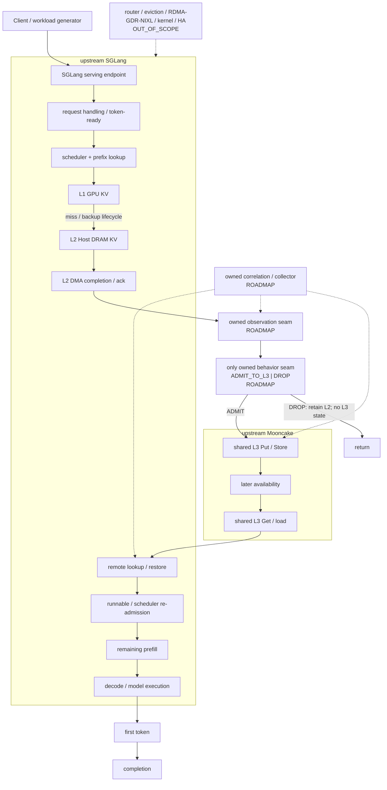
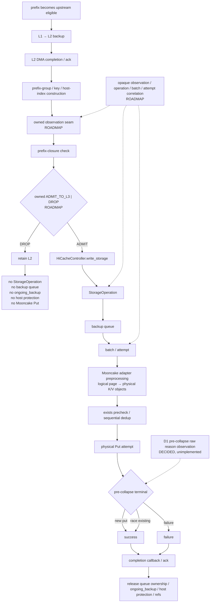
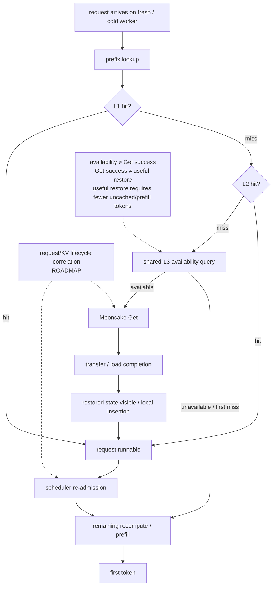
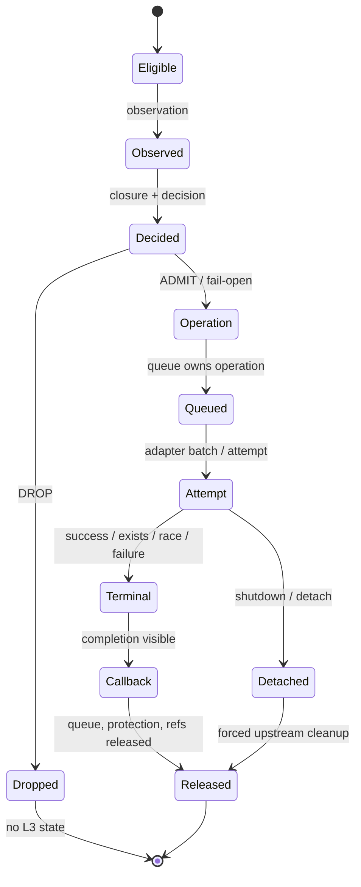
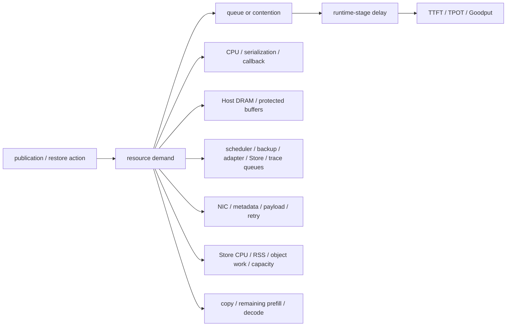

# Agentic-KV System Performance Path and Optimization Surface Map

> 文档性质：项目特定的性能路径、观测面、控制面与优化边界地图；不修改项目 Gate、STOP、scope 或当前状态。

本文件服从 [PROJECT_EVALUATION_SOP](../project/PROJECT_EVALUATION_SOP.md)、[PROJECT_PLAN](../project/PROJECT_PLAN.md) 和 [STATUS](../../STATUS.md)。它不修改项目 Gate、STOP、scope、claim state 或当前完成状态。实际进度与已验证结果以 [STATUS.md](../../STATUS.md) 为准。

## 1. 权威、用途与非目标

本文把固定版本源码事实、请求路径、异步生命周期、资源传播和 ownership 放在同一张项目地图中。第一次接手项目的工程师应能从一个性能症状沿以下链条定位：

```text
相关路径
  → 可能的等待或资源压力
  → 可观察证据
  → 推荐工具
  → upstream / owned 归属
  → 是否允许修改
  → 对应因果链
  → 合法下一步
```

仓库中两份 performance 文档的职责边界是：

```text
PERFORMANCE_ENGINEERING_PLAYBOOK.md
回答：面对异常时，按照什么方法调查、选择工具、提出假设和形成 RCA。

PERFORMANCE_PATH_AND_OPTIMIZATION_MAP.md（本文）
回答：系统中有哪些关键路径，时间、数据、状态和资源如何流动；
每个节点能观察什么、由谁拥有、是否受本项目控制、可以优化到什么程度。
```

本文不是另一份性能诊断 SOP，也不是项目路线图。具体的假设驱动调查闭环、工具升级规则和 RCA 记录模板由 [Performance Engineering Playbook](./PERFORMANCE_ENGINEERING_PLAYBOOK.md) 维护；本文只提供项目特定的路径索引、owner、观测缺口、优化面与 claim ceiling。

本文的事实和边界来源如下：

- [AGENTS.md](../../AGENTS.md)：仓库工作纪律和默认拒绝的 scope；
- [PROJECT_EVALUATION_SOP](../project/PROJECT_EVALUATION_SOP.md)：从路径真值向性能主张升级的证据纪律；
- [PROJECT_PLAN](../project/PROJECT_PLAN.md)：唯一机制、Gate、STOP 和两条候选性能因果链；
- [DECISIONS](../project/DECISIONS.md)：D1、D9、D10、D14 等 owner 决议；
- [G0 source/runtime audit](../implementation/G0_SOURCE_RUNTIME_AUDIT.md)：绑定 pinned commit 的调用关系和观测缺口；
- [D14 survival preregistration contract](../implementation/G0_D14_SURVIVAL_PREREGISTRATION_CONTRACT.md)：S1–S3 的 endpoint 与中介边界；
- [first-C0 deployment retrospective](../implementation/G0_FIRST_C0_DEPLOYMENT_RETROSPECTIVE.md)：首次 C0 的受限运行时事实。

本文明确不做以下事情：

- 不决定 S1–S3、G0–G4 是否通过，也不维护当前进度；
- 不授权 D1 trace patch、`ALWAYS_ADMIT` / `ALWAYS_DROP` hook 或任何 candidate；
- 不把首次 C0 的 restore 资格结果扩张为 S1、性能或通用兼容性结论；
- 不把被诊断的 scheduler、HiCache、Mooncake、网络或 GPU 模块变成本项目个人实现；
- 不替代固定版本源码审计，也不根据新版本文档覆盖 pinned source；
- 不记录 run-specific 数字、动态阈值、candidate 参数或简历 bullet。

## 2. 地图图例与分类词典

以下分类只用于描述路径 ownership 和允许动作，不是新的 claim state、Gate 或执行状态。

| 分类 | 含义 | 当前允许动作 |
|---|---|---|
| `OWNED_BEHAVIOR` | 唯一可改变行为的接缝：speculative publication 的 `ADMIT_TO_L3 \| DROP` | 仅在 canonical Gate 授权后实现和验证最小 binary hook |
| `OWNED_INSTRUMENTATION` | opaque correlation、operation/batch/attempt join、adapter physical-object result、collector、指标推导、workload replay 和 evidence pack | 只有相应 Gate 授权后实现；必须保持 non-interference |
| `UPSTREAM_OBSERVE_ONLY` | SGLang/Mooncake 的 scheduler、L1/L2、backup、lookup、restore、Put/Get、模型执行等 | 观察、归因、形成 RCA；默认不修改 |
| `CONDITIONAL_HANDOFF` | RCA 已把根因定位到本项目控制面外，并形成可复核证据 | upstream issue、独立后续项目或新的 owner scope 决议；本任务不自动修改 |
| `OUT_OF_SCOPE` | 当前项目明确排除的控制面或数据面 | 不实现；只有 canonical plan 和 owner decision 重新过 Gate 后才可重开 |

路径关系标签同样只描述可能性，不表示已测量：

| 标签 | 解释 |
|---|---|
| `synchronous` | 下游结果是继续当前阶段的必要前置 |
| `asynchronous` | 工作由后台 owner 接管，发起线程不等待完整服务完成 |
| `potentially overlapping` | CPU、copy、GPU 或队列工作可能重叠，不能直接相加 |
| `request critical path` | 可能直接决定该请求到 first token 的最晚依赖链 |
| `shared-resource indirect path` | 不在该请求调用栈中，但可通过资源竞争拖慢它或其他请求 |
| `diagnostic only` | 当前只允许观测、定位或 handoff，不授权修改 |

当前正式项目机制是 **Shared-L3 Publication Admission**。唯一 owned behavior-changing decision 是：

```text
L1 → L2 backup 完成
  → L2 DMA completion / ack
  → prefix-closure 检查
  → ADMIT_TO_L3 | DROP
  → upstream Mooncake Put 或直接返回
```

SGLang HiCache、L1/L2 生命周期、backup、remote lookup、restore、scheduler 与模型执行属于 upstream；Mooncake shared L3、Put/Get、存储与传输实现也属于 upstream。本项目只拥有 speculative/opportunistic L3 publication admission、所需窄 hook、观测 correlation、workload、实验和证据。

## 3. 系统边界与服务总路径



系统边界的关键含义：

- serving endpoint 到 first token 的直接路径主要由 upstream 请求处理、scheduler、lookup/restore、remaining prefill 和模型执行组成；
- publication write path 通常不是产生该 KV 的同一请求的直接 TTFT 阶段，但会占用 queue、CPU、Host DRAM、NIC 和 Store，形成共享资源间接路径；
- fresh/cold Worker B 的 restore 可能直接处于 resumed request 的 TTFT critical path；
- owned admission 只能改变“是否发起 speculative L3 publication”，不能直接修改 restore、scheduler 或 GPU execution；
- 图中的 owned instrumentation 和 behavior seam 当前均是 `ROADMAP`，不表示已经实现。

## 4. 端到端请求性能路径

从请求到完成的稳定阶段划分如下：

```text
request arrival
  → parsing / token-ready
  → scheduler waiting
  → prefix lookup
  → L1/L2/L3 resolution
  → restore or recompute / remaining prefill
  → scheduler execution
  → first token
  → decode
  → completion
```

### 表 1A：端到端路径节点地图

| Path | Stage | Owner | Input | Output/state | Sync/async | Observable | Resource | Endpoint relation | Allowed action | Failure modes |
|---|---|---|---|---|---|---|---|---|---|---|
| request | arrival / parsing | `UPSTREAM_OBSERVE_ONLY` | client request | token-ready request | synchronous | client timestamp、request status；具体内部拆分取决于 upstream telemetry | CPU、network | TTFT direct | client timing；必要时 upstream RCA | parse error、front-door queue、clock mismatch |
| request | scheduler waiting | `UPSTREAM_OBSERVE_ONLY` | runnable/pending request | selected batch or continued wait | synchronous | service metrics；项目级 request-stage correlation 尚未实现 | CPU、scheduler queue、GPU slots | TTFT direct；也影响 Goodput | observe/handoff；admission 只能经资源压力间接影响 | backlog、starvation、head-of-line、rank skew |
| lookup | prefix lookup | `UPSTREAM_OBSERVE_ONLY` | token/page keys | continuous available prefix | synchronous | pinned source；first-C0 有 scoped storage-token artifact；完整 request/KV trace 尚无 | CPU、metadata、L1/L2/L3 | TTFT direct | observe only | first miss、stale availability、key/config mismatch |
| read | L3 availability / Get | `UPSTREAM_OBSERVE_ONLY` | missing local prefix | completed load or miss/failure | synchronous or overlapping | adapter/source metrics 部分可用；项目 attempt correlation 尚未实现 | CPU、queue、NIC、Store、Host DRAM | resumed TTFT direct | observe only；publication 可影响 future availability | exists 但 Get 失败、timeout、partial availability、late completion |
| read | runnable / re-admission | `UPSTREAM_OBSERVE_ONLY` | restored/local state | execution slot | synchronous | 需要 lifecycle trace；当前不能逐请求闭合 | scheduler queue、CPU、GPU slots | TTFT direct | upstream diagnosis | restore 节省被 queue wait 吞掉 |
| compute | remaining prefill | `UPSTREAM_OBSERVE_ONLY` | uncached tokens | prompt KV + runnable decode | synchronous; may overlap copy | `cached_tokens_details.storage`、uncached token accounting；profiler 按需 | GPU、HBM、CPU launch | TTFT direct；影响 Goodput | observe only | recompute、copy/compute serialization、shape/JIT cold path |
| compute | first token | `UPSTREAM_OBSERVE_ONLY` | scheduled decode step | first output token | synchronous | client TTFT、request output | GPU、scheduler | TTFT endpoint | measure only | queue/compute tail |
| compute | decode / completion | `UPSTREAM_OBSERVE_ONLY` | KV + generated sequence | tokens / terminal request | iterative | client TPOT/ITL、completion/error | GPU、CPU、network | TPOT/Goodput direct；不是 TTFT 前缀阶段 | observe only | decode stall、error、cancellation、collective skew |
| write | L1→L2 backup / L2 ack | `UPSTREAM_OBSERVE_ONLY` | eligible upstream node/group | L2-resident KV | asynchronous relative to prior serving work | pinned source；完整 timing/correlation 尚未实现 | copy engine、Host DRAM、CPU | 通常非同请求 TTFT；共享资源间接影响 | instrumentation only | DMA failure、ack delay、host pressure |
| write | publication decision | `OWNED_BEHAVIOR` + `OWNED_INSTRUMENTATION` | complete prefix group after L2 ack | ADMIT or DROP | synchronous hot seam | 当前未实现；未来 decision trace | CPU、metadata | shared-resource indirect；policy overhead 可能直接干扰 | Gate 授权后最小实现 | exception、closure failure、excess overhead |
| write | L3 Put lifecycle | `UPSTREAM_OBSERVE_ONLY` | `StorageOperation` / batch / objects | terminal + cleanup | asynchronous / overlapping | source facts；D1 和 correlation 未实现，不能观测 new physical Put truth | queue、CPU、Host DRAM、NIC、Store | shared-resource indirect | observe only；admission controls whether work exists | dedup、race、failure、late callback、shutdown leak |

指标边界：

- TTFT 只覆盖 arrival 到 first token；decode 后的 TPOT/ITL 不能混入 TTFT；
- Goodput 是 workload、SLO 和时间窗口上的 endpoint，不是单请求局部阶段耗时；
- publication write path 的 service time 不等于当前请求 TTFT 增量；
- restore 即使减少 prefill tokens，也可能被 Get wait、scheduler re-admission、remaining prefill 或其他 queueing 抵消；
- admission 对 TPOT 通常没有直接控制，若 TPOT 变化，先检查共享资源竞争、batch composition 或 correctness regression。

## 5. Shared-L3 publication 写路径

### 5.1 写路径与 DROP / ADMIT 分支



固定源码路径是：

```text
_inc_hit_count
  → write_backup
  → _finish_write_through_ack
  → write_backup_storage
  → HiCacheController.write_storage
  → backup thread
  → MooncakeStore.batch_set_v1
```

这条调用关系是 pinned SGLang `b058dc910619c9d4bce9e9e24117104ffc491fa6` 的 `SOURCE_VERIFIED` 事实。唯一 behavior seam 位于 `HiRadixCache.write_backup_storage` 已构造 `top`、key/hash、`host_value`、`prefix_keys` 之后，调用 `HiCacheController.write_storage` 之前。函数名和顺序来自 [G0 source/runtime audit](../implementation/G0_SOURCE_RUNTIME_AUDIT.md)，不是对其他版本的推断。

### 5.2 数据与状态层级不能混用

| 层级 | 含义 | 不能被替代为 |
|---|---|---|
| logical prefix group | root/anchor 起始、连续有序 logical pages 的 all-or-none decision unit | 单个 physical object 或任意 suffix |
| logical KV page | SGLang controller 处理的逻辑页 | 一次 Put 或一条 NIC packet |
| `StorageOperation` | `write_storage` 创建并交给 backup queue 的 upstream operation | admission decision 本身 |
| adapter batch / attempt | controller batch 进入 adapter 的一次尝试 | 整个 prefix group 的唯一 terminal |
| physical K/V object | adapter preprocessing 展开的实际 K/V object；还可能有 split-head objects | logical page 或 wire bytes |
| actual new Put | D1 所要求的 pre-collapse `new_put` 原因 | `put_result=0`、submitted bytes 或 precheck miss |
| exists skip | precheck 已存在，未提交 Put | race existing |
| race existing | precheck miss，但 Put 时发现竞争 writer 已创建 | new Put success |
| failure | 未获得 success/race-existing terminal | partial success；固定 upstream 未实现该语义 |
| terminal cleanup | callback/ack 后 queue、ongoing backup、protection 和 refs 闭合 | 仅看到 Put 返回 |

### 表 1B：publication 写路径节点地图

| Stage | Owner | Input | Output/state | Sync/async | Observable evidence | Current observability gap | Resource affected | Endpoint relation | Allowed action | Failure modes |
|---|---|---|---|---|---|---|---|---|---|---|
| upstream eligibility | `UPSTREAM_OBSERVE_ONLY` | hit/selective state、node | eligible backup node/group | asynchronous trigger | pinned source 可见合法 seam 信号 | 没有项目级 eligibility stream trace | CPU、metadata | indirect | observe | selective semantics 漂移、group 不完整 |
| L1→L2 backup | `UPSTREAM_OBSERVE_ONLY` | device indices | `host_value` / L2 resident KV | async DMA | source path；L2 runtime oracle 待 hook 阶段 | 无 request→DMA→ack correlation | copy、Host DRAM | indirect contention | instrumentation only | DMA/ack delay、allocation failure |
| input construction | `UPSTREAM_OBSERVE_ONLY` | node/chain、host indices | keys、host indices、optional prefix keys | synchronous | source-verified inputs | callback 是否覆盖完整连续 group 必须由运行时证明 | CPU、Host DRAM | hot-seam overhead | observe | prefix mismatch、missing anchor |
| observation / closure | `OWNED_INSTRUMENTATION` | complete prospective group | opaque IDs、closure result | synchronous | 未实现 | correlation 与 non-interference 均缺失 | CPU、metadata | possible direct overhead | Gate 后实现最小 trace | lock/serialization、trace loss、false closure |
| ADMIT/DROP | `OWNED_BEHAVIOR` | closed group、合法在线信号 | action/reason | synchronous | 未实现 | forced actions、fail-open 和 overhead 均缺失 | CPU | indirect；过慢时可直接干扰 | Gate 后仅改该 seam | exception、wrong action、closure STOP |
| DROP return | `OWNED_BEHAVIOR` | DROP | L2 retained；不创建 L3 state | synchronous | source seam 支持预期；runtime oracle 未运行 | 需证明无 operation/queue/protection/Put | none beyond decision | no publication work | 可修改的核心 action | 意外创建 async state、改变 L2 |
| `write_storage` / operation | `UPSTREAM_OBSERVE_ONLY` | admitted keys/host indices | `StorageOperation` queued | async handoff | source verified | operation ID 与 decision 尚不能 join | queue、Host DRAM | indirect | propagate opaque ID only | enqueue failure、orphan operation |
| backup queue | `UPSTREAM_OBSERVE_ONLY` | operation | dequeued batch work | async | source verified | queue depth 与 dwell 尚无 owned trace | queue、CPU、Host DRAM | indirect contention | observe | backlog、shutdown、starvation |
| adapter preprocess | `UPSTREAM_OBSERVE_ONLY` | logical batch | physical keys/pointers/sizes | synchronous in worker | source verified | physical results 尚不能可靠回连 decision | CPU、packing buffer | indirect | trace-only fields | serialization error、bad size/key |
| exists / dedup | `UPSTREAM_OBSERVE_ONLY` | physical keys | skip or Put set | synchronous/remote | adapter-visible precheck 可设计观测 | 当前无项目 trace；precheck 不证明最终新建 | CPU、NIC metadata、Store | indirect | observe | stale precheck、sequential dedup |
| physical Put terminal | `UPSTREAM_OBSERVE_ONLY` | object/buffer | new/race/failure raw result | async/remote | D1 已决定 pre-collapse seam | D1 未实现；归约后 success 非单射 | NIC、Store CPU/RSS/capacity | indirect | trace-only patch 需另行授权 | race、timeout、failure、retry |
| callback / release | `UPSTREAM_OBSERVE_ONLY` | terminal batch | ack、state/ref release | async | source cleanup facts | terminal→cleanup correlation 未实现 | CPU、Host DRAM | indirect | observe/handoff | late callback、leak、detach race |

## 6. Shared-L3 lookup 与 restore 读路径



关键区分：

- `exists` / availability 只说明 query time 的可用性，不等于随后 Get 成功；
- completed Get 只说明数据完成加载，不等于它被请求消费、替代了 prefill；
- useful restore 必须有匹配的 Get/load 证据，并实际减少 uncached/prefill tokens；
- Get 完成后，请求仍可能等待 scheduler re-admission；
- restore、CPU 工作、copy 与 remaining prefill 可能重叠，不能把各自 duration 直接相加；
- query-time unavailable 只能证明当时不可用；没有 SOURCE_VERIFIED telemetry 时，不能断言具体 eviction victim、时间或原因。

### 表 1C：restore 读路径节点地图

| Stage | Owner | Input / output | Observable now | Critical-path possibility | Queue/resource | Allowed optimization | Failure modes | Claim ceiling |
|---|---|---|---|---|---|---|---|---|
| coldness qualification | `OWNED_INSTRUMENTATION` + experiment | fresh worker/request → local-cold certificate | first-C0 有受限 artifact；通用 collector 未实现 | 决定证据有效性，不是服务阶段 | worker state、L1/L2 | 只完善实验/证据，不改 upstream cache | hidden local hit、state reuse、key mismatch | 只证明具名 run 的 coldness |
| ordered prefix lookup | `UPSTREAM_OBSERVE_ONLY` | page keys → continuous prefix length | pinned first-miss source fact；项目 trace 未实现 | direct TTFT | CPU/metadata | observe only | first miss、partial physical availability | path truth |
| availability | `UPSTREAM_OBSERVE_ONLY` | physical/logical keys → available count | adapter/source 能力；当前无全链 join | direct TTFT | Store metadata、NIC | publication 只影响 future composition | stale answer、timeout | query-time availability only |
| Mooncake Get | `UPSTREAM_OBSERVE_ONLY` | available objects → buffers/result | first-C0 scoped Get/load artifact；完整 attempt trace 未实现 | direct TTFT; may overlap | adapter queue、NIC、Store、Host DRAM | observe/handoff | missing after exists、failure、slow transfer | completed Get only |
| load/local visibility | `UPSTREAM_OBSERVE_ONLY` | buffers → restored local state | pinned storage-token accounting；scoped C0 runtime result | direct TTFT | Host DRAM、copy、GPU | observe only | incomplete load、late visibility | restored tokens; not endpoint benefit |
| runnable / re-admission | `UPSTREAM_OBSERVE_ONLY` | restored request → selected batch | 当前缺 request lifecycle correlation | direct TTFT | scheduler queue、CPU/GPU slots | upstream diagnosis | queue wait、starvation | stage attribution only |
| remaining prefill | `UPSTREAM_OBSERVE_ONLY` | uncached tokens → KV | storage-cached/uncached tokens 可观测；profiler 按需 | direct TTFT | GPU、CPU launch、HBM | observe/handoff | recompute、copy serialization | avoided token mechanism when paired |
| first token | `UPSTREAM_OBSERVE_ONLY` | scheduled request → output | client timing | endpoint | scheduler、GPU | measure | tail latency、error | paired TTFT/Goodput only |

首次 C0 已在其固定 r6 拓扑中证明 stock A→external C→fresh B 的 `RESTORE_PATH_PASS` 和 `REMOTE_VALUE_SURVIVES`。该事实的 claim ceiling 仍是首次 C0 restore qualification：它不是 fresh C1、S1、G0 completion 或性能结果。

## 7. Prefix closure 与数据可达性

remote lookup 按顺序查找，并在第一个缺失 page 停止。因此：

```text
ancestor available
  → descendant 才可能通过连续 prefix lookup 被利用
```

若 ancestor 被 DROP 而 descendant 被 ADMIT，就可能形成不可达 hole：系统支付了 publication 成本，却不能产生 useful Get。closure 因而同时是：

- **正确性约束**：策略不得主动制造 first-miss 之前的空洞；
- **性能约束**：不可达 publication 只增加 CPU、queue、Host DRAM、NIC 和 Store work；
- **决策成本**：group 构造、ancestor/anchor 检查与 metadata 扫描本身占用 CPU，必须计入 policy overhead。

D9 决定首轮采用 prefix group all-or-none：从 root 或可证明已驻留 anchor 开始的完整连续 logical pages，只能整体 ADMIT 或整体 DROP。若 callback 不能证明完整连续 prefix，则不能假设 suffix 可独立复用。当前不为 page-level admission 新增远端目录或 metadata RPC。

closure failure 是 correctness STOP，不是能被 payload 或 TTFT 正结果抵消的工程代价。

## 8. 异步生命周期与资源所有权



| State/resource | Owner | Acquire point | Release responsibility | Required terminal evidence | Current gap |
|---|---|---|---|---|---|
| `StorageOperation` | upstream SGLang | `write_storage` | controller/backup lifecycle | success/failure/shutdown 后不残留 | decision join 未实现 |
| backup queue entry | upstream SGLang | operation enqueue | backup thread / detach cleanup | depth/dwell/terminal 可关联 | queue trace 未实现 |
| `ongoing_backup` | upstream SGLang | `write_backup_storage` after operation | backup ack or forced detach | 回到 baseline | runtime lifecycle oracle 未运行 |
| host protection | upstream SGLang | admitted backup state | ack or detach force release | ref/protection 回到 baseline | correlation 未实现 |
| buffer reference | upstream adapter/controller | batch/transfer preparation | terminal/cleanup path | 无 leak/use-after-free | exact runtime evidence 尚无 |
| correlation map | `OWNED_INSTRUMENTATION` | observation/operation join | terminal or bounded detach cleanup | 不参与行为且有界 | 未实现 |
| trace buffer | `OWNED_INSTRUMENTATION` | event emission | collector drain/drop policy | bounded、可报告 loss、不得阻塞 serving | 未实现 |
| attempt terminal | upstream result；owned observation | physical attempt | terminal record and join | new/race/failure 原因可区分 | D1 未实现 |
| shutdown/detach state | upstream SGLang | lifecycle stop | upstream force-release | late callback 不重建已释放 state | 需真实 case |

至少要区分这些终态：DROP、Put success、precheck exists、sequential dedup、two-writer race、Put failure、policy exception fail-open、shutdown、late callback、trace buffer full。固定 upstream 未实现 partial success，不得用 mock 把它写成已覆盖语义。

> 一个性能优化只有在 queue、ref、protection 和 callback 生命周期仍然闭合时才是有效工程优化。

## 9. 资源压力传播地图



### CPU

可能来源：decision logic、prefix-group 构造、metadata 扫描、serialization、trace logging、scheduler、adapter preprocessing 和 completion callback。症状可表现为 GPU gap、scheduler delay、queue backlog、TTFT tail 或 rank skew。

### Host DRAM

可能来源：L2 KV、protected host buffer、outstanding Put/Get、packing buffer、trace buffer 和 Store resident data。症状可表现为 capacity pressure、memory-bandwidth contention、delayed release、OOM 或 allocation failure。

### Queue

至少区分 scheduler queue、backup queue、adapter/transfer queue、Store-side work queue 和 trace buffer queue。queue depth 是某时点/区间的积压量；queue dwell 是一个 operation 从入队到开始服务的等待时长。高 depth 不自动等于每个请求高 dwell，低平均 depth 也可能掩盖 tail dwell。

### Network

来源包括 actual Put/Get payload、metadata、retry、fragmentation 和 concurrent Get/Put contention。adapter payload bytes 不等于 NIC/wire bytes：前者不包含完整协议头、metadata、复制和重试。NIC utilization 只能作为 mediator，不能单独证明 publication 是 endpoint 根因。

### Mooncake Store

关注 object creation、exists check、dedup/race、capacity pressure、CPU/RSS 和 request concurrency。没有官方、pinned telemetry 时，query-time unavailable 不能升级为精确 occupancy、victim 或 eviction reason。

### GPU

关注 remaining prefill、recompute、restore copy/load、decode、copy/compute overlap 和 CPU launch starvation。当前项目不默认优化 kernel；只有上层路径证据把瓶颈定位到具体 compute/copy critical path 后，才升级到 GPU/operator/kernel diagnosis。

## 10. 两条候选性能因果链

两条链都是 PROJECT_PLAN 允许验证的候选解释，不是当前已成立结论，也不预先决定 candidate。

### 链 A：写成本 / 资源争用

```text
publication decision
  → actual new physical Put work
  → backup queue / CPU / Host DRAM / NIC / Store pressure
  → request-stage waiting or interference
  → TTFT / Goodput
```

| Arrow | 最小证据 | 断裂条件 |
|---|---|---|
| decision → work | forced action 和 manipulation check；admitted/submitted/new physical Put 分层对账 | exists/dedup 已消除绝大多数 new Put |
| work → resource | 同 arm 的 attempt、queue dwell、CPU/DRAM/NIC/Store mediator 同向变化 | Put 异步完全隐藏或资源宽松 |
| resource → endpoint | paired online endpoint 与 mediator 同向，correctness/TPOT 非劣 | endpoint 不响应或瓶颈来自 read/GPU/L2 |

最大允许主张：只看到 payload bytes，只能说 payload efficiency；bytes 与 resource 同向，只能说机制一致性；action、mediator 与 paired endpoint 全部闭合，才是固定测床上的性能因果链。

### 链 B：容量 / 查询时可用性

```text
publication decision
  → shared-L3 内容组成
  → query-time availability
  → completed / useful Get
  → avoided prefill / recompute
  → TTFT / Goodput
```

| Arrow | 最小证据 | 断裂条件 |
|---|---|---|
| decision → composition | isolated fresh Store、各 arm 自身的 action/lifecycle evidence | L3 roomy 或 action difference 太小 |
| composition → availability | query-time availability 与 demand 对齐；不伪称 victim/eviction | unavailable 无法与 useful demand 对齐，或只有 modeled occupancy |
| availability → useful Get | Get/load terminal + storage-cached tokens + fewer uncached/prefill tokens | remote Get 近零、Get 失败或 restore 未替代计算 |
| useful Get → endpoint | paired endpoint、相同 coldness/request/output 和 queue witness | restore 不优于 recompute，或 re-admission 吞掉节省 |

最大允许主张：只有 unavailable 只能说可用性观察；availability、useful Get 和 token substitution 闭合后是机制链；再加 paired endpoint 才是性能因果链。false negative 丢掉高价值 prefix、宽松容量或固定 upstream 已足够时，本链应断裂。

## 11. 优化面地图

### 表 2：优化面矩阵

| Optimization surface | Ownership class | Can observe now? | Can change now? | Needed evidence | Primary mediator | Endpoint | Scope result |
|---|---|---:|---:|---|---|---|---|
| speculative L3 ADMIT/DROP | `OWNED_BEHAVIOR` | 否；仅 source seam 已定位 | 否；hook 未授权/未实现 | fresh C1 与 S1–S3 ruling、forced action、lifecycle oracle | operation/Put existence | indirect to TTFT/Goodput | 当前项目唯一 behavior surface，Gate 后才可实现 |
| prefix-group decision / closure | `OWNED_BEHAVIOR` | 部分：source first-miss；无 runtime decision trace | 否 | all-or-none、完整 anchor/group、no hole | useful reachability、CPU overhead | mechanism/correctness | 可改，但 closure 失败直接 STOP |
| decision/reason/fail-open overhead | `OWNED_BEHAVIOR` | 否 | 否 | forced action、exception、CPU timing、stock equivalence | CPU/lock | possible direct interference | 最小实现，不建 policy framework |
| correlation completeness | `OWNED_INSTRUMENTATION` | 否 | 否；需 Gate 授权 | observation→operation→batch/attempt→terminal→cleanup join | evidence loss rate | claim validity | trace-only；不得改变行为 |
| bounded trace buffering | `OWNED_INSTRUMENTATION` | 否 | 否 | disabled/enabled A/B、full-buffer behavior | CPU/memory/lock | non-interference | trace loss 显式报告，不阻塞 serving |
| workload replay / evidence pack | `OWNED_INSTRUMENTATION` | 首次 C0 有一次性 artifact；通用组件未实现 | 仅按 Gate | deterministic input、manifest、raw log、hash | reproducibility | claim validity | owned experiment surface |
| `StorageOperation` count | upstream state indirectly affected | 当前无 decision join | admission 可间接改变 | forced ADMIT/DROP + operation trace | backup queue | indirect | 不把 operation 实现归为 owned |
| backup queue pressure | upstream state indirectly affected | source known；项目 dwell trace 未实现 | 只能经 admission 间接改变 | queue depth+dwell+attempt+endpoint | CPU/Host DRAM | chain A | 不修改 queue implementation |
| host protection duration | upstream state indirectly affected | source known；runtime join 缺失 | 只能经 admitted work 间接改变 | protection acquire/release pairing | Host DRAM | chain A/correctness | leak 时 FAIL/handoff |
| physical Put work | upstream state indirectly affected | 否；D1 未实现 | admission 可改变是否存在 | pre-collapse new/race/failure result | NIC/Store | chain A | D1 只观测，不改 Mooncake behavior |
| shared-L3 composition | upstream state indirectly affected | 只可用 availability/useful Get 间接观测 | admission 可因果影响 | isolated Store、own-arm lifecycle | capacity | chain B | 不拥有 eviction |
| useful Get / recompute tokens | upstream state indirectly affected | 部分：storage/uncached token accounting 可用 | admission 只能影响 future availability | Get/load + token substitution + paired control | NIC/GPU prefill | chain B | 不修改 read path |
| SGLang scheduler / re-admission | `UPSTREAM_OBSERVE_ONLY` | metrics 部分可用；细粒度 trace 缺失 | 否 | request lifecycle、queue dwell、profiler | scheduler queue | TTFT/Goodput | RCA / upstream handoff |
| Mooncake adapter / Store | `UPSTREAM_OBSERVE_ONLY` | source 与 scoped runtime 部分可见 | 否 | attempt trace、Store/OS counters | CPU/RSS/NIC/capacity | chain A/B | RCA / upstream handoff |
| CPU serialization / network / copy overlap | `UPSTREAM_OBSERVE_ONLY` | 工具可按需观察 | 否 | hypothesis-specific profile + endpoint | CPU/NIC/copy | TTFT/Goodput | diagnosis only |
| prefill/decode operator / multi-rank collective | `UPSTREAM_OBSERVE_ONLY` | profiler 可按需观察 | 否 | timeline→operator→kernel evidence | GPU/collective | TTFT/TPOT | diagnosis；当前 TP=1 主线不含 rank optimization |
| scheduler、Mooncake backend、RDMA/GDR/NIXL、eviction、router、KV quant/sparse、kernel、PD、HA | `OUT_OF_SCOPE` | 可在 RCA 必要时观察 | 否 | 新的独立问题证据和 owner decision | varies | varies | 不静默扩 scope；handoff 或另立项目 |

## 12. 症状到路径的入口地图

### 表 3：症状分诊表

| Symptom | Likely path | Competing explanations | Minimum evidence | Tool | Controllability |
|---|---|---|---|---|---|
| restore 成功但 TTFT 不降 | Get→load→runnable→re-admission→remaining prefill | Get 慢、scheduler wait、remaining tokens、copy overlap、measurement noise | matched Get/load、storage/uncached tokens、stage timeline、paired endpoint | lifecycle trace；必要时 Nsight Systems / Torch Profiler | admission 仅间接；scheduler/read path 只诊断 |
| Put activity 高且 endpoint 下降 | decision→operation→queue/resource→request wait | dedup、read pressure、GPU compute、offered-load drift | forced action、new Put truth、queue dwell、CPU/NIC/Store mediator、paired endpoint | adapter/D1 trace、OS/Store/NIC counters | admission 可控，底层只诊断 |
| Put bytes 下降但 endpoint 不变 | write path 与 overlap | async hiding、roomy resources、错误 bytes 口径 | new/race/exists 分层、queue/resource slack、service curve | lifecycle trace、service metrics | payload-only claim ceiling |
| capacity 变小后 useful Get 下降 | composition→availability→Get→prefill | coldness/key mismatch、Store config 未生效、read failure | fresh Store segment response、availability、Get/load、uncached tokens、paired endpoint | request/KV trace、Store response | admission 可能间接可控；eviction 不可控 |
| policy 开销导致 TTFT 上升 | decision hot seam | scheduler CPU、trace serialization、lock contention | disabled/forced action A/B、decision CPU、queue/endpoint | decision trace、`py-spy` / `perf` | owned behavior/instrumentation |
| GPU timeline 有 gap | request stage→CPU launch→GPU | scheduler wait、sync、I/O、JIT/cold path | CPU/GPU timeline joined to request | Nsight Systems、Torch Profiler | 通常只诊断 |
| collective duration 异常 | per-rank compute→collective arrival | rank skew、late CPU launch、network | multi-rank aligned timeline | multi-rank Nsight Systems | 当前 TP=1 主线外 |
| first request only 慢 | cold startup path | JIT、native extension、graph capture、page fault、warm-up | cold/warm split、build/JIT logs、repeat | trace / profiler | baseline qualification，不归因 admission |
| trace-enabled 性能变差 | instrumentation emission→buffer/serialization | workload drift、run order、logging backend | stock/disabled/enabled paired A/B、event loss、CPU/memory | client timing、CPU profiler、trace counters | owned instrumentation；non-interference failure |
| TPOT 退化但 TTFT 不变 | decode/shared-resource path | publication contention、batch composition、GPU operator | per-token timing、resource mediator、timeline | service metrics、Nsight Systems | admission 仅在 mediator 闭合后可归因 |

表中不提供固定“健康值”。任何阈值、SLO、load knee 和物质性判据都必须由相应 preregistration/manifest 冻结，不能从本文生成。

## 13. 工具到系统路径的映射

| Tool/evidence | 最适合观察 | 不足以单独证明 |
|---|---|---|
| service metrics / client timing | Goodput、TTFT、TPOT/ITL、request error、offered-load service curve | 具体 Put/Get 中介或 ownership |
| project lifecycle trace（ROADMAP） | request、prefix group、observation、decision、operation、batch/attempt、adapter terminal、later Get/recompute、queue dwell、cleanup | 没有 paired endpoint 时的性能因果 |
| `py-spy` / `perf` | Python scheduler、decision logic、serialization、lock 和 CPU hot path | GPU 或网络根因；profile sample 也不等于 endpoint causality |
| OS / Store / NIC counters | CPU/RSS、memory、queue、network、Store pressure | publication 是 endpoint 根因；它们只是 mediator |
| Nsight Systems | CPU/GPU/copy/collective timeline、overlap、GPU idle gap、rank skew、critical path | 未定位具体 operator 时的 kernel 根因 |
| Torch Profiler | Python operator→CUDA kernel 关联、prefill/decode breakdown、CPU launch、CUDA Graph 周边 | wire/Store 状态或跨 worker lifecycle |
| Nsight Compute | 已经定位的 representative hot kernel 的局部硬件原因 | 端到端收益、scheduler/Store 根因或当前项目 ownership |

工具升级顺序固定为：

```text
先路径和可证伪假设
  → 再选择能区分解释的最小工具
  → 最后才进入 kernel
```

## 14. Critical path、异步与 overlap 规则

- 异步 Put 的 wall time 不等于产生该 KV 的请求 TTFT 增量；
- completion callback 可能晚于实际传输完成，必须区分 service completion 和 completion visibility；
- queue dwell、service time、callback delay 是三个不同量；
- restore 可与 CPU、copy 和 remaining prefill 重叠，只有依赖图上的最晚路径进入 TTFT；
- collective 的表观 duration 可能包含其他 rank 的迟到；
- GPU 空白可能来自 CPU 尚未 launch，不自动等于 kernel 不够快；
- 多个函数 duration 不能无条件相加；
- shared-resource contention 可以不在同一请求调用栈中，却影响其他请求；
- microbenchmark 改善只有回到真实 serving workload 和 paired endpoint 后才能升级 claim。

示例一（仅说明方法，不是当前观察结果）：

```text
Put service time = A ms
但 backup queue 无积压、NIC/Store 有余量、endpoint 不变
→ 不能说 Put 给 TTFT 增加了 A ms
```

示例二（仅说明方法，不是当前观察结果）：

```text
Get 减少了 prefill tokens
但 request 在 runnable→scheduler admit 等待 B ms
→ restore 的计算节省可能未传导到 TTFT
```

## 15. Ownership、优化与 handoff 规则

```text
发现异常
  → 定位到哪个路径节点
  → admission 是否能改变该节点？
      ├─ 能直接改变：最小 forced-action 验证
      ├─ 只能间接改变：闭合 action→mediator→endpoint
      └─ 不能改变：STOP / substrate limitation / upstream handoff / 新项目裁决
```

### admission 可控

在 Gate 已授权的前提下，只做最小验证：forced action、manipulation check、mediator、paired endpoint 和 regression/correctness。不能因为“可能更优”直接设计 candidate。

### admission 只能间接影响

例如 backup queue、physical Put、L3 composition、useful Get 和 recompute tokens。必须用各 arm 自己的运行时 lifecycle 闭合中介链，不能用相关性、另一 arm 的 eligibility stream 或 offline ledger 替代。

### admission 不可控，但阻断项目价值

合法处理是：记录 RCA；根据 [PROJECT_PLAN](../project/PROJECT_PLAN.md) 判断 S1/S2/S3/G2 是否 `STOP` 或 `INCONCLUSIVE`；将根因声明为当前 substrate limitation；证据足够时形成 upstream issue/handoff。不能为“完成项目”修改 scheduler、Mooncake backend 或 kernel。

### admission 不可控，且是独立有价值问题

只能另立后续项目或请求新的 owner scope 决议。当前文档不授权把项目静默改造成 scheduler、transfer、kernel 或 eviction optimization。

一个有效 handoff 至少包含：pinned identity、最小复现、路径节点、输入/输出、competing explanation、raw evidence、当前 claim ceiling，以及为什么 admission 无法修复该节点。

## 16. 路径证据到性能主张的升级规则

证据梯子：

```text
Path truth
  → State/action truth
  → Mechanism truth
  → Resource truth
  → Endpoint truth
  → External validity
```

### 表 4：claim ceiling

| Observed evidence | Allowed conclusion | Forbidden conclusion | Next evidence required |
|---|---|---|---|
| Worker B 的匹配 remote Get/load | 具名 run 的 restore path truth | restore 有性能收益 | local-cold、token substitution、paired endpoint |
| `cached_tokens_details.storage > 0` 且 uncached/prefill tokens 降低 | 该受限 run 中 remote KV 替代了非零 prefill | S1/TTFT/Goodput 改善 | restore-vs-recompute paired endpoint interval |
| DROP 没有 operation/queue/protection/Put | forced DROP 的 state/action truth | policy 有价值或更快 | own-arm mechanism + resource + endpoint |
| admitted/submitted payload bytes 下降 | offered/submitted payload 改变 | new physical Put 下降 | D1 pre-collapse new/race/failure attribution |
| `new_physical_put_bytes` 下降 | actual new Put mechanism 改变 | NIC traffic 或 TTFT 同比例下降 | wire/resource mediator + paired endpoint |
| adapter payload bytes | KV object payload accounting | NIC/wire bytes | OS/NIC/wire counter 与 retry/metadata accounting |
| query-time unavailable | 当时对象不可用 | 发生了具体 eviction、victim 或原因 | pinned Store telemetry/event evidence |
| completed Get | backend load terminal | useful restore / avoided prefill | request join + storage/uncached token substitution |
| queue/CPU/NIC/Store counter 同向变化 | 机制一致的 resource mediator | endpoint causality | paired action manipulation + endpoint interval |
| profiler screenshot / hot stack | 某次 profile 的局部热点候选 | 已确认根因或 owned optimization | reproducible hypothesis test + endpoint |
| paired TTFT/Goodput 变化 | endpoint truth in fixed cohort | 由 admission 的某条机制导致 | action→mediator→endpoint chain、regression/fairness |
| fixed cohort 上完整因果链 | 受限 C2 性能结论 | 普适/production 结论 | held-out / external workload 和明确边界 |
| upstream 改动或能力 | substrate fact / upstream contribution | 个人实现 | owned deletion test、patch/test/artifact |

禁止的快捷升级包括：path truth→性能、hit rate→avoided prefill、submitted bytes→new physical Put、payload bytes→wire traffic、resource counter→endpoint causality、profiler screenshot→根因、upstream optimization→个人贡献。

## 17. 当前项目的稳定优化优先级

优先级描述“证据依赖顺序”，不是 candidate、任务承诺或当前进度。

### P0：必须先保证

path truth、prefix closure、L2 correctness、fail-open、async lifecycle、observability non-interference、deterministic correlation 和 payload accounting correctness。

### P1：当前机制真正的性能优化面

在 Gate 允许后，验证是否能减少低价值 actual Put work、降低 write-path resource pressure、改善 bounded capacity 下 useful availability，以及降低 decision/trace overhead。

### P2：证据触发的 upstream diagnosis

scheduler re-admission、Mooncake Store/adapter、CPU serialization、network/copy overlap、prefill/decode operator 和 rank skew。

> P2 可以产生高价值 RCA，但不自动成为当前项目 owned optimization。

### P3：当前 scope 外

kernel rewrite、RDMA/GDR/NIXL、eviction、router、PD separation、KV quantization/sparsity 和 HA。

> P3 只有新的系统证据和新的 owner decision 才能进入另一个项目。

## 18. 地图维护规则

本文只在稳定系统地图变化时更新：

- pinned commit 改变并完成新的 source audit；
- source-verified 路径、owner 或 seam 发生变化；
- 新增实际可观察字段，或 planned observability 获得实现/实验 artifact；
- 已验证的 upstream handoff 改变 optimization surface；
- 路径的 claim ceiling 因新证据发生变化。

本文不得维护：当前任务进度、run-specific 数字、candidate 参数、某次 Gate outcome、动态 issue 列表、简历 bullet 或完整 RCA。实际状态归 [STATUS](../../STATUS.md)，Gate/STOP 归 [PROJECT_PLAN](../project/PROJECT_PLAN.md)，owner 决议归 [DECISIONS](../project/DECISIONS.md)，运行结果应进入相应 implementation/runtime artifact、RCA、results index 或 regime map。

路径从 `ROADMAP` 到 `IMPLEMENTED_UNVALIDATED` 再到 `EXPERIMENTALLY_VALIDATED` 的变化，必须先由 `STATUS.md` 和对应 artifact 成为事实权威；本文只同步地图，不反向升级状态。

## 19. 对抗式自审清单

- [ ] 本文仍是系统地图，而不是第二份 roadmap、STATUS 或 performance SOP。
- [ ] 唯一 behavior-changing seam 仍是 L2 ack 后、`write_storage` 前的 `ADMIT_TO_L3 | DROP`。
- [ ] 所有 roadmap observation、trace 和 hook 都没有写成已实现。
- [ ] upstream SGLang/Mooncake、scheduler、restore、Put/Get 和模型执行没有写成 owned code。
- [ ] direct critical path、shared-resource indirect path 和 overlap 已区分。
- [ ] logical KV bytes、physical-object payload 与 NIC/wire bytes已区分。
- [ ] availability、completed Get、useful restore 和 avoided prefill 已区分。
- [ ] query-time unavailable 没有被写成 eviction proof。
- [ ] 异步 Put duration 没有直接累加到 TTFT。
- [ ] scheduler re-admission 可能吞掉 restore 收益已明确。
- [ ] 每个优化面都有 owner、当前可观测性、允许动作和 claim ceiling。
- [ ] admission 不可控的根因只会触发 STOP、substrate limitation、handoff 或新 owner decision。
- [ ] 没有未经 pinned audit 支持的新函数、版本、阈值或行为事实。
- [ ] 首次 C0 仅保持 restore qualification claim，没有升级为 fresh C1、S1、G0 或性能结果。
- [ ] 没有设计 candidate，也没有扩大到 scheduler、eviction、transport、kernel 或 HA。
